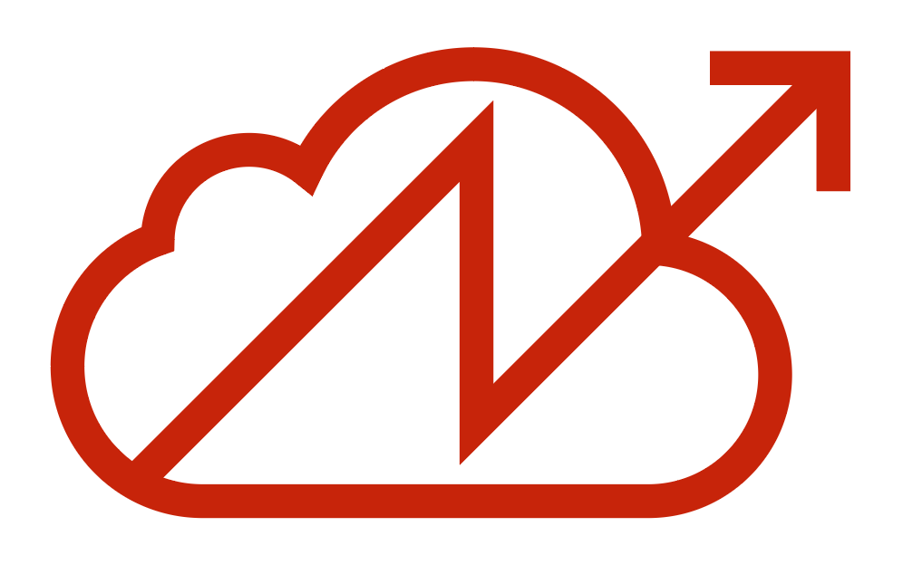

# New-Dependencies
Dear Reader,

This is my Master Thesis *New Dependencies*. In it I ask whether we can learn from the political squatting movement when trying to build a more sustainable digital practice.

You can download the latest version here in different formats, at the moment:

- markdown. Written in [Typora](https://typora.io/), so some features might not work in all markdown editors
- apple pages if that's your jam
- pdf for everything else

I would appreciate any form of feedback :-)

