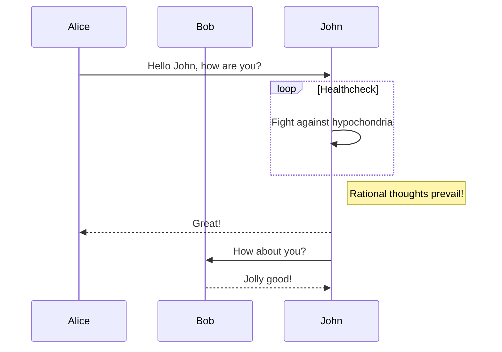
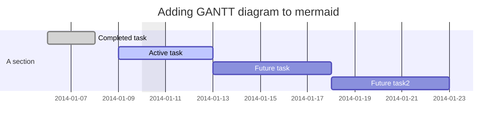
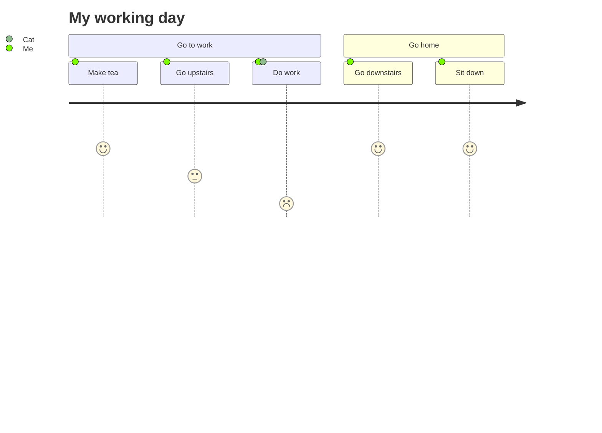
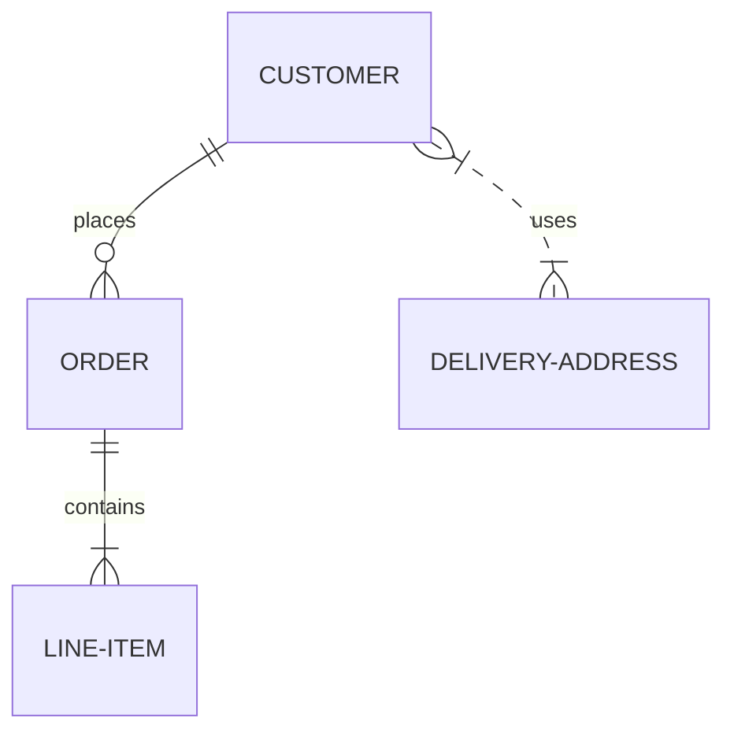
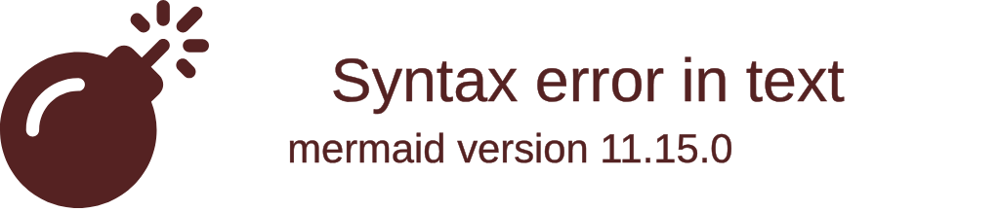
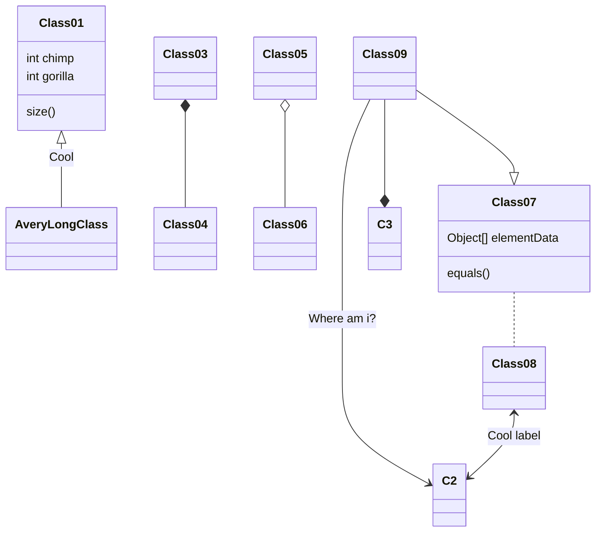

# sequence

```sequence
actor a->actor b: Thank you, very cool.
Note left of actor a: what you think is happening
Note right of actor a: Inside your head
Note left of actor b: Inside their head
Note right of actor b: what is actually happening
actor b-->actor a: Stop talking to me I beg you
actor b->the superstructure: Please sir I need a house
actor b->the superstructure: My children are hungry
Note left of the superstructure: The superstructure has long seized the means of production
```

# flowchart

```flow
st=>start: Start:>http://www.google.com[blank]
e=>end:>http://www.google.com
op1=>operation: My Operation
sub1=>subroutine: My Subroutine
cond=>condition: Yes
or No?:>http://www.google.com
io=>inputoutput: catch something...
para=>parallel: parallel tasks

st->op1->cond
cond(yes)->io->e
cond(no)->para
para(path1, bottom)->sub1(right)->op1
para(path2, top)->op1
```


# mermaid flowchart


# mermaid sequence



# mermaid gantt



# mermaid user journey



# mermaid entity relationships



# mermaid git graph



# mermaid class diagram



