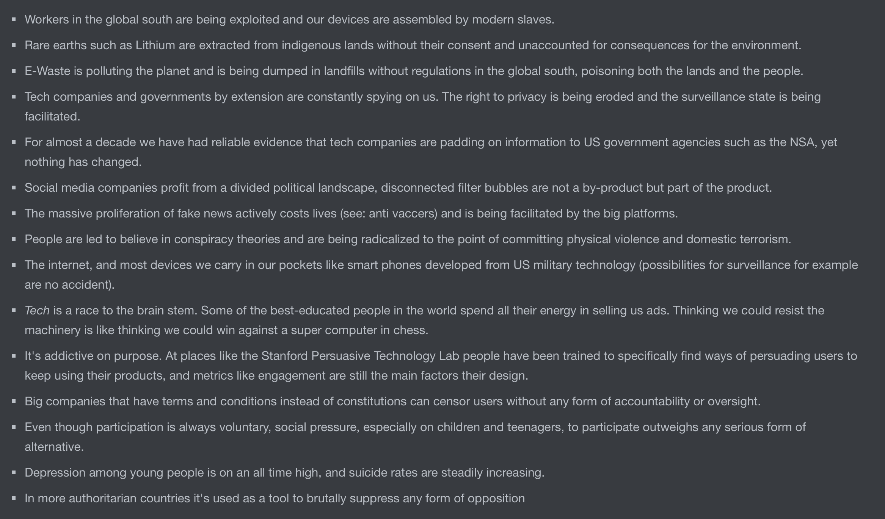
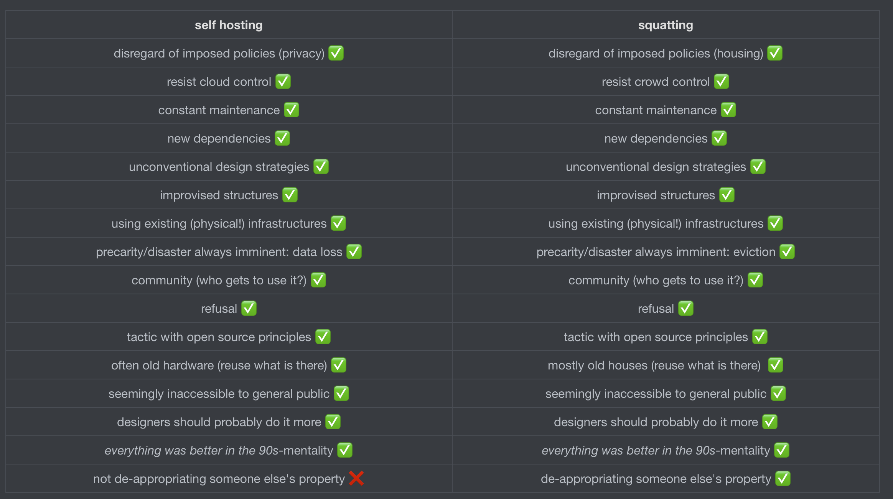

Dear Reader,

asiugdi;audsiugadsgiuadsiguals

# Missing Dependencies

[TOC]

## 1. Cloud Gazing

On September 12th, 2010 the Youtube Channel revelation13net uploaded a video titled *By Psychokinesis a Psychic turns a Cloud into a Square Cloud in Sept. 2010.* In this 02:18 video, a man is filming the sky with a handheld camera. Visible is a single cloud on an otherwise entirely blue sky, lined by some trees on the edge of the frame. We never see the person holding the camera but can hear them speak throughout the video. They introduce themselves as *T. Chase* and explain that they will now attempt to change the shape of the cloud into a square through psychic powers. They keep repeating this statement like a mantra of sorts, altering and distorting their voice as the video progresses. The cloud slowly changes shape, and by the end of the video it does look more like a square than in the beginning of the video, even though it's hard to say whether this might have just been the way it naturally changed shape.

In September 2008, the free software advocate Richard Stallman expressed his concerns regarding cloud computing to the Guardian, claiming that it was *stupid*[^1] and just a way to lock users into proprietary ecosystems. Stallman is a prominent advocate for privacy and the open source movement, and (among a lot of other things) founder of the Free Software Foundation. He is well-respected in the tech community, but his statements about cloud computing received mixed responses. He was accused of populism[^2], supposedly ignoring the lived realities of actual users who are often already trapped on their operating systems and office suites anyway and don't necessarily have the capacities to practice the cloud refusal he was preaching[^ might be good to include an internal footnote here about privilege of refusal]. Others accused Stallman of simply stating the obvious. Reuven Cohan[^3] illustrated this criticism with a still from an episode of the animated TV show *the Simpsons,* which ended up becoming something of a meme later. The image shows a newspaper clipping in which Abe Simpson, the elderly father of one of the protagonists, Homer Simpson, angrily shakes his fist at the sky under the headline *Old Man Yells at Cloud*. Since my 30th birthday last month I sometimes think this image is actually about me.

The Cloud is a mystical space, its name is already opaque, veiling what it actually describes, which you could call network infrastructure, or maybe just: someone else's computer[^4]. Interestingly, the term originates from exactly this position of not knowing, of occlusion. In network diagrams the cloud is traditionally used to denote parts of the network that we have no control over or no concrete knowledge about. It's the part beyond the blinking lights of our router, to which we understand our devices connect, the abstraction of *the internet*. Its shape alludes to the uncertainty of what is out there, something that constantly changes shapes, is hard to grasp.

This inherent uncertainty is maybe why attempts to refuse *the cloud* can often feel futile. Even defining what it exactly is that we are refusing is already a tiring exercise. As it often is with computers, the conversation is one-sided, with us yelling at the cloud, trying to shape it, but not getting a response, because the cloud doesn't generally care. Still, a vague feeling of urgency remains.

In 2019, web designer Becca Abbe sensed the dawn of what she called *the internet's back-to-the-land movement*, a new movement of users away from the cloud, in reference to the 1960s counter cultural movements away from the cities in the US (which, in turn, directly informed the early beginnings of Silicon Valley's tech world)[^5]. It seems tempting to leave the celestial cloud, with all its fake news and inequalities, behind, to get back down to the *ground truth* so to say. But what exactly is this *land*, which we would return to, and who exactly is it that is going there?

[^1]: https://www.theguardian.com/technology/2008/sep/29/cloud.computing.richard.stallman
[^2]: https://web.archive.org/web/20081122005447/http://www.mathewingram.com/work/2008/09/29/hey-hey-you-you-get-off-of-my-cloud/
[^3]: https://web.archive.org/web/20081205032726/http://www.elasticvapor.com/2008/09/stupid-redux-old-man-gnu-yells-at-cloud.html
[^4]: https://www.amazon.com/Humor-There-cloud-someone-computer/dp/B07KW5MPH2
[^5]: https://www.are.na/blog/the-internet%27s-back-to-the-land-movement

## 2. Surfing the Web

Before the cloud was a cloud it was an ocean. In 1986, when the internet wasn't commercially available yet, it was mostly being used by scientists and governments. That year, in the Netherlands, Hans Rosenberg from Utrecht University founded the non-profit *SURF* (Samenwerkende Universitaire Reken Faciliteiten, *Co-operative University Computing Facilities*), which ran *SURFnet*, a computer network linking different academic institutions. *SURFnet* still exists today, and, among other things, founded and operates *eduroam*, an authentication infrastructure letting users in higher education facilities use wifi, which many readers might be familiar with.

A few years later, in 1989, and in direct proximity to the ocean, Susan Estrada of the San Diego Supercomputer Center founded one of the first internet service providers (ISP) in the world. San Diego being a surfer's paradise, she originally wanted to call it SURFnet, but since that name was already taken, she settled for CERFnet, an abbreviation for *California Education and Research Federation Network*, and a reference to Vint Cerf, one of the inventors of the TCP/IP protocol, so-called fathers of the internet and today Chief Internet Evangelist at Google.

In 1991, CERFnet released a promotional comic book, *The Adventures of Captain Internet And CERF Boy*[^6]. Filled to the brim with rad crossword puzzles and bad puns, it recounts the story of Diana Domain, her surf board slinging alter ego Captain Internet and her side kick CERFboy, fighting against their nemesis Count Crackula.

Unaware of this, just a year later, librarian Jean Armour Polly published an article called *Surfing the Internet* on the University of Minnesota Wilson Library Bulletin and shortly after that, Tom Mandel of Stanford Research Institute (SRI) wrote another one called *Surfing the Wild Internet*.

Polly (and probably Mandel) wanted to evoke the fun, but also the skill required to, well, surf the web, and the randomness, chaos, and even danger that the web itself presented [^7]. Computers and the internet are complicated and especially back then, when interfaces were less smooth, and personal computers were just beginning to become a thing, it perfectly captured this new, mysterious and seemingly bottomless place that was the internet[^23] (other exhausted geographic metaphors include cyberspace and the information highway).

Today nobody *surfs* anymore (the ocean has evaporated into the cloud, you could say). But, despite the immiscibility of water and technology, the image of the internet as a vast ocean, free from the constraints of the aground, physical world, an ocean that just has to navigated by a skilled steersman[^8] with an appropriate vessel[^9], lingers as residue if you know where to look; In the ports and berths that we use to connect our computers to the internet, torrent sites[^10], app icons of browsers[^11] or the names of NFT marketplaces.[^12] The Network is eternal[^13], and so is the ocean.

[^6]: https://archive.org/details/CaptainInternetAndCERFBoyNumber1October1991/mode/2up
[^7]: https://www.surfertoday.com/surfing/the-woman-who-coined-the-expression-surfing-the-internet/amp
[^23]: https://www.thehairpin.com/2011/02/people-literally-surfing-the-web/
[^8]: Cybernetics etymologically developed from steersman
[^9]: https://en.wikipedia.org/wiki/Netscape_Navigator
[^10]: Pirate Bay
[^11]: Safari
[^12]: Opensea.io
[^13]: https://archive.transmediale.de/content/the-eternal-network-1

## 3. Architectures of (De-)Appropriation

aosihdasodihadsoihadsoidashio

## 4. Back to the Sea

While some are trying their best to get back to the land, others want to get back to the sea. Where *homesteading* describes self-sufficient life on land, *seasteading* takes this idea a step further and out into the open sea (hypothetically, at least). Seasteading is an idea from San Francisco, and advocated for by the Seasteading Institute, which in turn was funded by venture capitalist and strangely obsessive Lord of the Rings fan[^14] Peter Thiel, with the goal of making governments *smart*. Claiming that most of the land in the world is already taken, the seasteaders propose building floating cities in international waters, free from convention, regulation, and taxes.

Up until 2020 most attempts to make these dreams a reality had been of moderate success, with crypto millionaire, anti-taxer[^15] and anti-vaxxer[^16] Chad Elwartowski coming closest when he and his girlfriend lived 12 nautical miles off the coast of Thailand in a small, elevated, floating platform for a total of two months before being discovered by the Thai government and having to flee the country in fear of prosecution for violating the country's independence.[^17] Elwartowski is one of the founders of Ocean Builders, a company dedicated to the promotion of seasteading, that has been developing so called *SeaPods*, floating luxury homes that look remarkably similar to Apple AirPods in the concept renders[^18]. The platform in Thailand (which looked nothing like those renders) had been the first prototype.

But in 2020, Ocean Builders decided to give it one more try. Due to the COVID-19 pandemic, the cruise ship industry had almost gone under and they managed to buy an old, 245m cruise ship for a bit less that $10m, around ⅒ of its pre-pandemic price. They named it the MS Satoshi, after the (presumed) author of the Bitcoin white paper. The plan was to lay anchor off the coast of Panama, where it would be incorporated into an artificial, floating island in the shape of the Bitcoin B[^19]. Until then they would auction off the 777 cabins[^20] to a clientele of digital nomads, startup founders and crypto enthusiasts, and finally establish the first truly free, crypto-only (and mostly-male), seasteading society (or *seavilization*).

Sophie Elmhirst recounts the following unfolding of unfortunate events in great detail for the Guardian[^21]. The day the ocean builders officially gained ownership of the ship, its certificates of seaworthiness had expired. They had to sail it from Greece to Gibraltar to have it dry-docked and inspected, before finally starting the voyage across the Atlantic to Panama. There they had hoped to be able to de-register the ship, for it to legally become a floating residency in order escape strict maritime law, but the government of Panama insisted that, while they were allowed to anchor, the MS Satoshi had to officially remain a ship. This came with a lot of issues regarding the disposal of waste water and especially insurance: The team was unable to find anybody that would agree to insure their stationary crypto-ship, and facing the enormous costs of running it, including having a crew on board at all times, and the fact that they were not able to sell enough cabins, they had to cancel their plans and sell the ship, before ever making it to Panama, but not before calling the corona pandemic a conspiracy by the global elites and somehow blaming everything on them[^22]. Elmhirst fittingly sums up the MS Satoshi's dilemma. "The high seas", she writes, "while appearing borderless and free, are, in fact, some of the most tightly regulated places on Earth".

[^14]: https://www.bbc.com/news/technology-38315682
[^15]: https://www.reddit.com/r/AskReddit/comments/o5jepd/what_do_you_wish_was_illegal/h2pagzw/
[^16]: https://www.reddit.com/r/AskReddit/comments/oanhr8/what_invention_has_done_more_harm_than_good/h3kfxdh/
[^17]: https://youtu.be/OovkeOuZsqU?t=340
[^18]: https://oceanbuilders.com/
[^19]: https://2oxut21weba5oivlniw6igeb-wpengine.netdna-ssl.com/wp-content/uploads/2020/12/2020-12-22-Convert-Cruise-Ships-Into-Sustainable-Seasteads.pdf
[^20]: https://www.reddit.com/r/Bitcoin/comments/jefmth/so_i_am_buying_a_cruise_ship_and_naming_it_ms/
[^21]: https://www.theguardian.com/news/2021/sep/07/disastrous-voyage-satoshi-cryptocurrency-cruise-ship-seassteading
[^22]: https://vivavivas.com/2020/12/19/ms-satoshis-journey-coming-to-an-end/

## 5. Reasons to Refuse *the Cloud* (in no particular order)

## 6. Back to the Land

tightly regulated, like the internet

this is not pirate radio of the 60s (started in NL)

decalration of independence, not true

actually it's physical, real rooms (tubes)

​	so physical it can be cut in half (not meant as incitement of political action against the infrastructures the internet runs on)

the text from internet archive guy: today one is augmented on the other, we are not talking about some foreign, utopic, free space anymore, we are talking about a space where the same policies and inequalities take place

​	it is not the fun place that it was in the 90s, it's mobile and augmented

​	it's certainly not a cloud, and it's also not everywhere

that is the "land" in back to the land, the cables etc. Back to the land as thinking about infrastructure. Of not considering cyberspace a seperate place, but the same

die revolution, das goldene zeitalter, sind ausgeblieben. deshalb ist es interessant sich die bildsprache anzugucken.

​	**need to look over this again after the brewster kahle article**

also the netmom article can be a good reference!

​	https://www.netmom.com/surfing/who-invented-surfing-the-internet

the whole seasteading insta https://www.instagram.com/ocean_builders/
	and their blog https://oceanbuilders.com/blog/
	quite cool, one of their first sites https://web.archive.org/web/20190603133905/https://ocean.builders/

and the designer lol https://www.instagram.com/p/BTjyVDSg7Pg/
	of course she's a burner
	and a dj
	and into tarot cards lol
	her company: https://www.instagram.com/liveonmxrs/

seasteading as open source!

web3.0 sees the land as the waste that has to be avoided, so let's finally get to the question of what the land is.

the land is the infrastructure of the internet. It's cables (some of them under water, but at least aground), it's rooms, etc. Many have talked about this (tubes, evan roth, the transmediale woman)

maybe the division is a false dichotomy: we need to treat the digital with the same logic as space. Think about actual connections etc?

## 7. Who Would Win?

## 8. Hotel Mokum

On the 16th of October we squatted the former Hotel Marnix in Amsterdam.