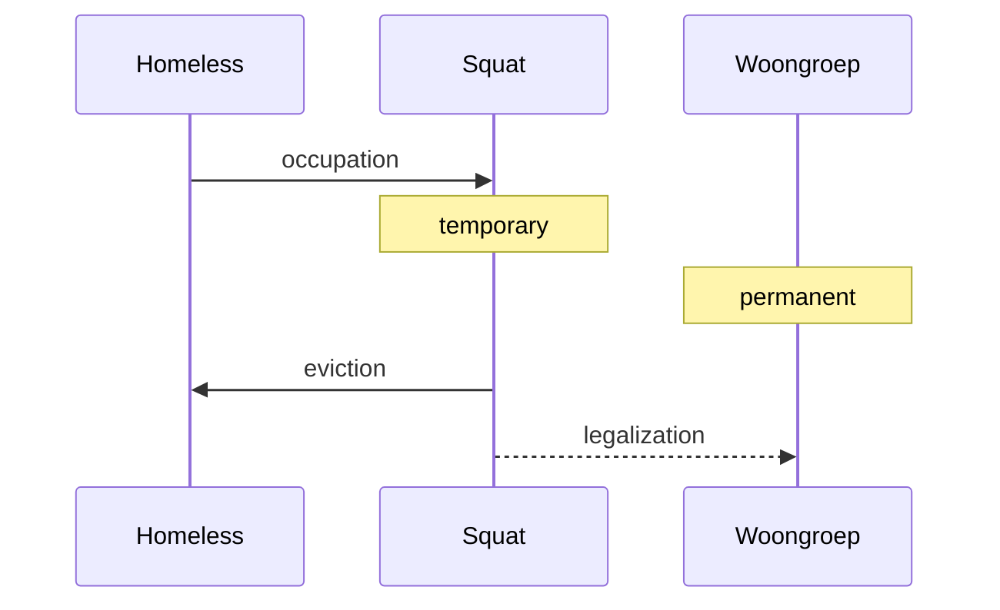
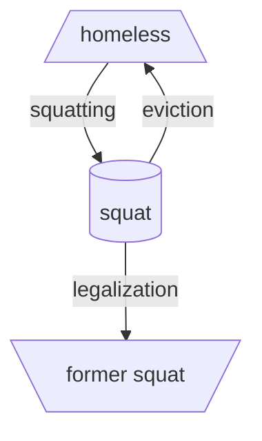
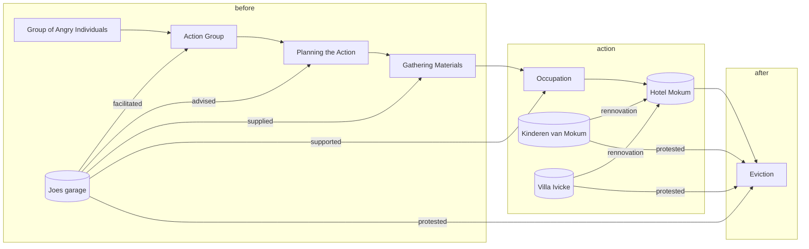
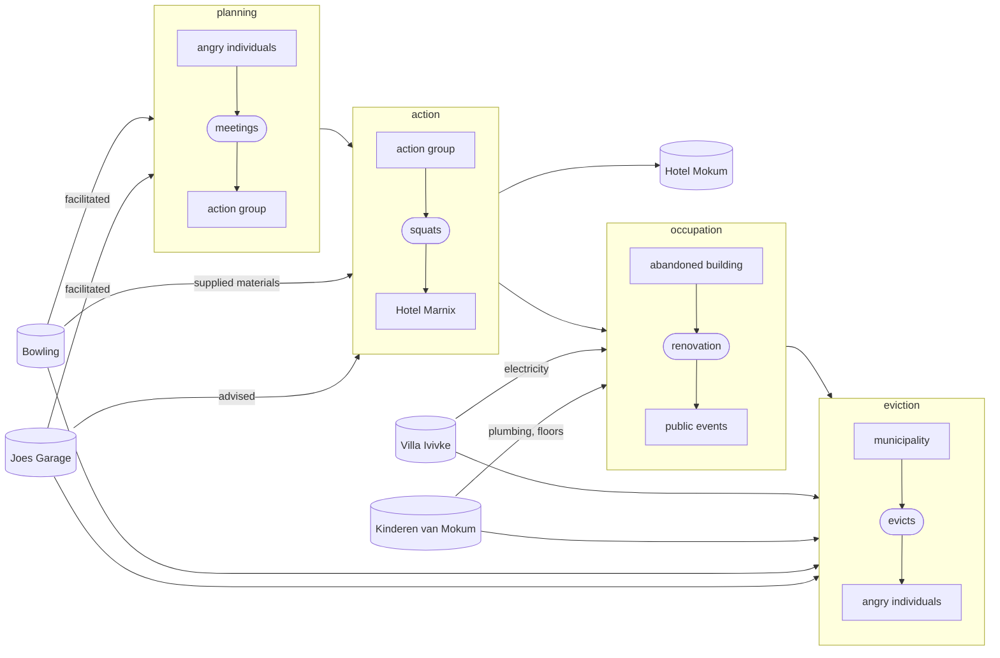

# temporary/permanent

```mermaid
sequenceDiagram
    participant Homeless
    participant Squat
    participant Woongroep
    Homeless->>Squat: occupation
    Note over Squat: temporary
    Note over Woongroep: permanent
    Squat->>Homeless: eviction
    Squat-->>Woongroep: legalization
```
# impermanence

```mermaid
graph TD;
		A[/homeless\];
		B[(squat)];
		C[\former squat/];
    A-- squatting -->B;
    B-- eviction -->A;
    B-- legalization -->C;
```

# Mokum Journey

```mermaid
graph LR;
		1[Group of Angry Individuals];
		2[Action Group];
		3[Planning the Action];
		4[Gathering Materials];
		5[Occupation];
		6[(Hotel Mokum)];
		7[Eviction];
		A[(Joes garage)];
		B[(Kinderen van Mokum)];
		C[(Villa Ivicke)];
		
		subgraph before
			1-->2-->3-->4;
			A-- facilitated -->2;
			A-- advised -->3;
			A-- supplied -->4;
		end
		subgraph action
			4-->5-->6;
			A-- supported -->5;
    	B-- rennovation -->6;
    	C-- rennovation -->6;
		end
		subgraph after
			6-->7
			A-- protested -->7;
			B-- protested -->7;
			C-- protested -->7;
		end
```

# Mokum Journey 2

```mermaid
flowchart LR;
		1[(Joes Garage)];
		2[(Bowling)];
		3[(Kinderen van Mokum)];
		4[(Villa Ivivke)];
		5[(Hotel Mokum)];
		
    A[angry individuals];
    B([meetings]);
    C[action group];
    
    subgraph planning;
    		A-->B-->C;
    end;
    1-- facilitated -->planning;
    2-- facilitated -->planning;
    
    D[action group];
    E([squats]);
    F[Hotel Marnix];
    
    subgraph action;
    		D-->E-->F;
    end;
    action --> 5;
    1-- advised -->action;
    2-- supplied materials -->action;
    
    G[abandoned building];
    H([renovation]);
    I[public events];
    
    subgraph occupation;
    		G-->H-->I;
    end;
    3-- plumbing, floors -->occupation;
    4-- electricity -->occupation;
    
    J[municipality]
    K([evicts])
    L[angry individuals]
    
    subgraph eviction
    		J-->K-->L
    end
    1 & 2 & 3 & 4 --> eviction
    
    planning-->action;
    action-->occupation;
    occupation-->eviction;
```

# 
