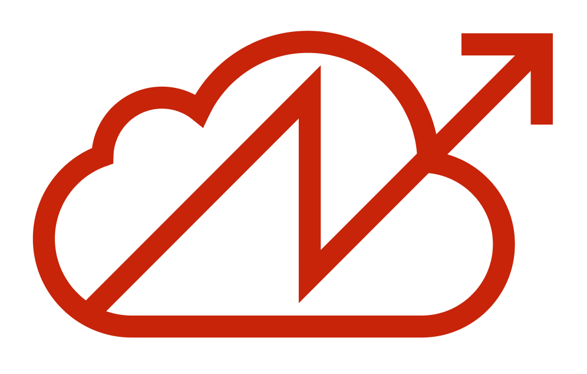
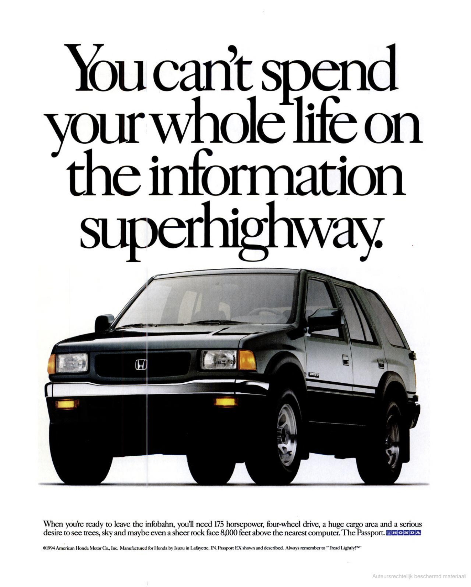
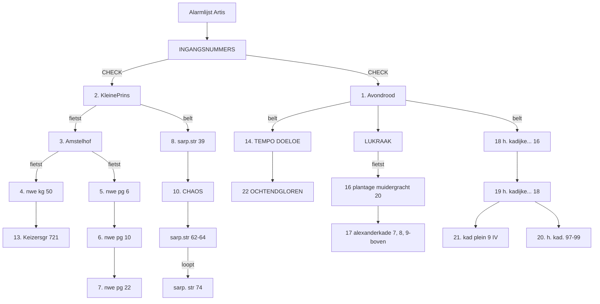
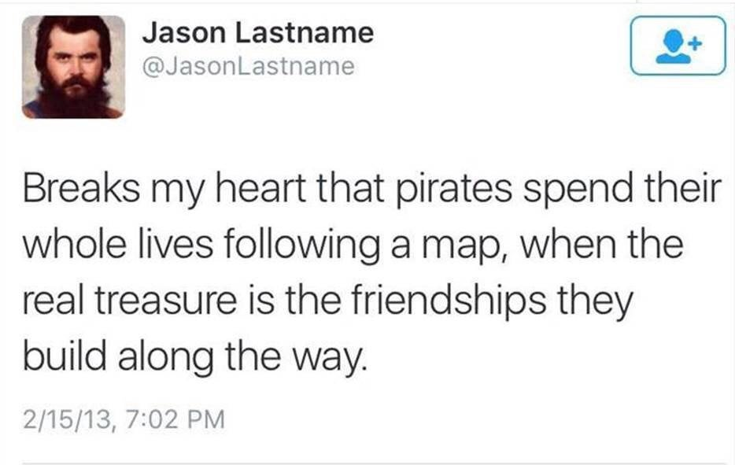

# New Dependencies

[TOC]

## Abstract

*Dear Reader,*

*This text is a nomadic journey from the (or: this) abstract to the material. I am trying to establish a lineage between a spatial practice like squatting and a (for lack of a better term) digital practice like self hosting. First, I examine the spatial and geographical metaphors we (have) use(d) to describe the internet, and argue that any understanding of it as a separate, autonomous space is insufficient. I then argue that the need for alternative practices is imminent, and that tactics and sentiments from the squatting movement could be applied to their digital counterparts. As an example, I examine how squats don't function as autonomous spaces per se, but rather as nodes situated in larger contexts and (support) networks, reliant on a new set of dependencies that they define for themselves. I do take for granted a certain understanding of what is wrong with the internet today. You can find a summary of this, a starting point of sorts, in the appendix.*

fig AB.1: A Thundercloud, a mix of a cloud icon and the international squatting sign that resembles lightning strike.

## 0 Who would Win?

|                         self hosting                         |                          squatting                           |
| :----------------------------------------------------------: | :----------------------------------------------------------: |
|            refusing imposed policies (privacy) ✅             |            refusing imposed policies (housing) ✅             |
|                    resist cloud control ✅                    |                    resist crowd control ✅                    |
|                    constant maintenance ✅                    |                    constant maintenance ✅                    |
|                      new dependencies ✅                      |                      new dependencies ✅                      |
|  improvised structures & unconventional design strategies ✅  |  improvised structures & unconventional design strategies ✅  |
|               using existing infrastructures ✅               |               using existing infrastructures ✅               |
|                  recycling (old hardware) ✅                  |                  recycling (old houses)  ✅                   |
| ephemeral & precarious, disaster always imminent: data loss ✅ | ephemeral & precarious, disaster always imminent: eviction ✅ |
|            community building (who is invited?) ✅            |            community building (who is invited?) ✅            |
|                   open source principles ✅                   |                   open source principles ✅                   |
|            my grandmother doesn't understand it ✅            |            my grandmother doesn't understand it ✅            |
|                         nostalgia ✅                          |                         nostalgia ✅                          |
|              situating yourself in a network ✅               |              situating yourself in a network ✅               |
| nomadic in nature: having to change ip addresses sometimes ✅ |  nomadic in nature: having to change addresses sometimes ✅   |
|              following manuals and protocols ✅               |              following manuals and protocols ✅               |
|                  programming (computers) ✅                   |                    programming (events) ✅                    |
|                hosting and serving (files) ✅                 |                hosting and serving (people) ✅                |
|            don't pay rent (software as service) ✅            |                don't pay rent (actual rent) ✅                |
|                   security (encryption) ✅                    |                   security (barricades) ✅                    |
|            Everything went downhill from ~2010 ✅             |            Everything went downhill from ~2010 ✅             |
|           de-appropriating someone else's space ❌            |           de-appropriating someone else's space ✅            |

fig 0.1: A lot of words in tech are similar to word used to describe physical space

## 1 Cloud Gazing

On September 12, 2010 the Youtube Channel revelation13net uploaded a video titled *By Psychokinesis a Psychic turns a Cloud into a Square Cloud in Sept. 2010.* In this 02:18 video, a man is filming the sky with a handheld camera. Visible is a single cloud on an otherwise entirely blue sky, lined by some trees on the edge of the frame. We never see the person holding the camera but can hear them speak throughout the video. They introduce themselves as *T. Chase* and explain that they will now attempt to change the shape of the cloud into a square through psychic powers. They keep repeating this statement like a mantra of sorts, altering and distorting their voice as the video progresses. The cloud slowly changes shape, and by the end of the video it does look more like a square than in the beginning of the video, even though it's hard to say whether this might have just been the way it naturally changed shape.

In September 2008, the free software advocate Richard Stallman expressed his concerns regarding cloud computing to the Guardian, claiming that it was stupid[^101]and just a way to lock users into proprietary ecosystems. Stallman is a prominent advocate for privacy and the open source movement, and (among a lot of other things) founder of the Free Software Foundation. He is well-respected in the tech community, but his statements about cloud computing received mixed responses. He was accused of populism[^102], supposedly ignoring the lived realities of actual users who are often already trapped in their operating systems and office suites anyway and don't necessarily have the capacities to practice the cloud refusal he was preaching. Others accused Stallman of simply stating the obvious. Reuven Cohan[^103] illustrated this criticism with a still from an episode of the animated TV show *the Simpsons,* which ended up becoming something of a meme later. The image shows a newspaper clipping in which Abe Simpson, the elderly father of one of the protagonists, Homer Simpson, angrily shakes his fist at the sky under the headline *Old Man Yells at Cloud*. Since my 30th birthday last month I sometimes think this image is actually about me.

The Cloud is a mystical space, its name is already opaque, veiling what it actually describes, which you could call network infrastructure, or maybe just: someone else's computer[^104]. Interestingly, the term originates from exactly this position of not knowing, of occlusion. In network diagrams the cloud is traditionally used to denote parts of the network that we have no control over or no concrete knowledge about. It's the part beyond the blinking lights of our router, the abstraction of *the internet*. Its shape alludes to the uncertainty of what is out there, something that constantly changes shapes, is hard to grasp.

This inherent uncertainty is maybe why attempts to refuse *the cloud* can often feel futile. Even defining what it exactly is that we are refusing is already a tiring exercise. As it often is with computers, the conversation is one-sided, with us yelling at the cloud, trying to shape it, but not getting a response, because the cloud doesn't generally care. Still, a vague feeling of urgency remains.

In 2019, web designer Becca Abbe sensed the dawn of what she called *the internet's back-to-the-land movement*[^105], a new movement of users away from the cloud, in reference to the 1960s counter cultural movements away from the cities in the US (which, in turn, directly informed the early beginnings of Silicon Valley's tech world). It seems tempting to leave the celestial cloud, with all its fake news and inequalities, behind, to get back down to the *ground truth* so to say. But what exactly is this *land*, which we would return to, and who exactly is it that is going there?

[^101]: https://www.theguardian.com/technology/2008/sep/29/cloud.computing.richard.stallman
[^102]: (https://web.archive.org/web/20081122005447/http://www.mathewingram.com/work/2008/09/29/hey-hey-you-you-get-off-of-my-cloud/
[^103]: https://web.archive.org/web/20081205032726/http://www.elasticvapor.com/2008/09/stupid-redux-old-man-gnu-yells-at-cloud.html
[^104]: https://www.amazon.com/Humor-There-cloud-someone-computer/dp/B07KW5MPH2
[^105]: https://www.are.na/blog/the-internet%27s-back-to-the-land-movement

## 2 Surfing the Web

Before the cloud was a cloud it was an ocean. In 1986, when the internet wasn't commercially available yet, it was mostly being used by scientists and governments. That year, in the Netherlands, Hans Rosenberg from Utrecht University founded the non-profit *SURF* (Samenwerkende Universitaire Reken Faciliteiten, *Co-operative University Computing Facilities*), which ran *SURFnet*, a computer network linking different academic institutions. *SURFnet* still exists today, and, among other things, founded and operates *eduroam*, an authentication infrastructure letting users in higher education facilities use wifi, which many readers might be familiar with.

A few years later, in 1989, and in direct proximity to the ocean, Susan Estrada of the San Diego Supercomputer Center founded one of the first internet service providers (ISP) in the world. San Diego being a surfer's paradise, she originally wanted to call it SURFnet, but since that name was already taken, she settled for CERFnet, an abbreviation for *California Education and Research Federation Network*, and a reference to Vint Cerf, one of the inventors of the TCP/IP protocol, so-called fathers of the internet and today Chief Internet Evangelist at Google.

In 1991, CERFnet released a promotional comic book, *The Adventures of Captain Internet And CERF Boy*[^201]. Filled to the brim with rad crossword puzzles and bad puns, it recounts the story of Diana Domain, her surf board slinging alter ego Captain Internet and her side kick CERFboy, fighting against their nemesis Count Crackula.

Unaware of this, just a year later, librarian Jean Armour Polly published an article called *Surfing the Internet* on the University of Minnesota Wilson Library Bulletin and shortly after that, Tom Mandel of Stanford Research Institute (SRI) wrote another one called *Surfing the Wild Internet*.

Polly (and probably Mandel) wanted to evoke the fun, but also the skill required to, well, surf the web, and the randomness, chaos, and even danger that the web itself presented [^202]. Using the internet became a sport, something you did for fun, and temporarily, before hanging up your wet suit and doing something else. Computers are complicated and especially back then, when interfaces were less smooth, people less sad[^203] and personal computers were just beginning to become a thing, it perfectly captured this new, mysterious and seemingly bottomless place that was the internet[^204] (other exhausted geographic metaphors include cyberspace, the electronic frontier and the information highway).

fig. 2.1: At least not today, those times are over. 1994 Advertising by Honda in an [outdoor magazine](https://books.google.nl/books?id=dc5rdg49tpUC&pg=PA83&lpg=PA83&dq=honda+%22spend+your+whole+life+on+the+information+superhighway%22&ots=8XaK4b9KBv&sig=ACfU3U1K-xQfXarY8aAC2thkeGYZ-MyFug&hl=en#v=onepage&q&f=false)

Today nobody *surfs* anymore (the ocean has evaporated into the cloud, you could say). But, despite the immiscibility of water and technology, the image of the internet as a vast ocean, free from the constraints of the aground, physical world, an ocean that just has to navigated by a skilled steersman[^205] with an appropriate vessel[^206], lingers as residue if you know where to look; In the ports and berths that we use to connect our computers to the internet, torrent sites[^207], app icons of browsers[^208] or the names of NFT marketplaces.[^209] The Network is eternal[^210], and so is the ocean.

[^201]: https://archive.org/details/CaptainInternetAndCERFBoyNumber1October1991/mode/2up
[^202]: https://www.surfertoday.com/surfing/the-woman-who-coined-the-expression-surfing-the-internet/amp
[^203]: still need to link to User—Agent thesis
[^204]: https://www.thehairpin.com/2011/02/people-literally-surfing-the-web/
[^205]: The word *cybernetics* originally developed from the word *steersman*
[^206]: https://en.wikipedia.org/wiki/Netscape_Navigator
[^207]: Pirate Bay
[^208]: Safari
[^209]: Opensea.io
[^210]: https://archive.transmediale.de/content/the-eternal-network-1

## 3 Back to the Sea

While some are trying their best to get back to the land, others want to get back to the sea. Where *homesteading* describes self-sufficient life on land, *seasteading* takes this idea a step further and out into the open sea (hypothetically, at least). Seasteading is an idea from San Francisco, and advocated for by the Seasteading Institute, which in turn was funded by venture capitalist and strangely obsessive Lord of the Rings fan[^301] Peter Thiel, with the goal of making governments *smart*. Claiming that most of the land in the world is already taken, the seasteaders propose building floating cities in international waters, free from convention, regulation, and taxes.

Up until 2020 most attempts to make these dreams a reality had been of moderate success, with crypto millionaire, anti-taxer[^302] and anti-vaxxer[^303] Chad Elwartowski coming closest when he and his girlfriend lived 12 nautical miles off the coast of Thailand in a small, elevated, floating platform for a total of two months before being discovered by the Thai government and having to flee the country in fear of prosecution for violating the country's independence.[^304] Elwartowski is one of the founders of *Ocean Builders*, a company dedicated to the promotion of seasteading, that has been developing so called *SeaPods*, floating luxury homes that look remarkably similar to Apple AirPods in the concept renders[^305]. The platform in Thailand (which looked nothing like those renders) had been the first prototype.

But in 2020, Ocean Builders decided to give it one more try. Due to the COVID-19 pandemic, the cruise ship industry had almost gone under and they managed to buy an old, 245m cruise ship for a bit less that $10m, around ⅒ of its pre-pandemic price. They named it the MS Satoshi, after the (presumed) author of the original Bitcoin white paper. The plan was to lay anchor off the coast of Panama, where it would be incorporated into an artificial, floating island in the shape of the Bitcoin B[^306]. Until then they would auction off the 777 cabins[^307] to a clientele of digital nomads, startup founders and crypto enthusiasts, and finally establish the first truly free, crypto-only (and mostly-male), seasteading society (or *seavilization*).

Sophie Elmhirst recounts the following unfolding of unfortunate events in great detail for the Guardian[^308]. The day the ocean builders officially gained ownership of the ship, its certificates of seaworthiness had expired. They had to sail it from Greece to Gibraltar to have it dry-docked and inspected, before finally starting the voyage across the Atlantic to Panama. There they had hoped to be able to de-register the ship, for it to legally become a floating residency in order escape strict maritime law, but the government of Panama insisted that, while they were allowed to anchor, the MS Satoshi had to officially remain a ship. This came with a lot of issues regarding the disposal of waste water and especially insurance: The team was unable to find anybody that would agree to insure their stationary crypto-ship, and facing the enormous costs of running it, including having a crew on board at all times, and the fact that they were not able to sell enough cabins, they had to cancel their plans and sell the ship, before ever making it to Panama, but not before calling the corona pandemic a conspiracy by the global elites and somehow blaming everything on them[^309]. Elmhirst fittingly sums up the MS Satoshi's ultimate dilemma. "The high seas", she writes, "while appearing borderless and free, are, in fact, some of the most tightly regulated places on Earth".

[^301]: https://www.bbc.com/news/technology-38315682
[^302]: https://www.reddit.com/r/AskReddit/comments/o5jepd/what_do_you_wish_was_illegal/h2pagzw/
[^303]: https://www.reddit.com/r/AskReddit/comments/oanhr8/what_invention_has_done_more_harm_than_good/h3kfxdh/
[^304]: https://youtu.be/OovkeOuZsqU?t=340
[^305]: https://oceanbuilders.com/
[^306]: https://2oxut21weba5oivlniw6igeb-wpengine.netdna-ssl.com/wp-content/uploads/2020/12/2020-12-22-Convert-Cruise-Ships-Into-Sustainable-Seasteads.pdf
[^307]: https://www.reddit.com/r/Bitcoin/comments/jefmth/so_i_am_buying_a_cruise_ship_and_naming_it_ms/
[^308]: https://www.theguardian.com/news/2021/sep/07/disastrous-voyage-satoshi-cryptocurrency-cruise-ship-seassteading
[^309]: (https://vivavivas.com/2020/12/19/ms-satoshis-journey-coming-to-an-end/

## 4 Back to the Land

Like the high seas, another place that many people thought was the epitome of freedom, but which turned out to be tightly regulated, is the internet. *A Declaration of the Independence of Cyberspace*[^401], which John Perry Barlow, founding member of the Electronic Frontier Foundation, published in 1996, is often used an example for this false optimism. As their name suggests, the EFF in the 90s perceived the internet as a new frontier, a wild and unexplored space for settlers to claim, where people could build new lives, new utopias, new modes of (smart?) governance. Barlow's text reads as a challenge to the governments of what he calls the *Industrial World*, or the world outside of the computers, who, according to him, had no legitimate claim to govern cyberspace.

Of course this document has to be seen in the context of its time, and it has been critiqued to exhaustion. Even preceding it, many[^402][^403][^404][^405] people have pointed out, and Barlow himself has admitted since, that this clear division between digital and physical space is not a very good model to describe the world—after all, the internet runs on real computers, which stand in real rooms that are connected to the rest of the world with real cables, all of which is powered by real electricity[^406]. The internet obviously runs on physical infrastructure[^407], which follows the rules of the physical world.

In 2021 probably not a lot of people would make this mistake anymore. In his essay *Imagining the Internet: Explaining our Digital Transition*, Brewster Kahle, founder of the Internet Archive, explores the different metaphors that we have collectively used to try to understand the internet throughout the years. According to him, around 2010 the internet became more and more mobile, and more and more tied to our real identities. Around that time political cartoons regarding anything online shifted in tone, from optimistic depictions of the future to people with phones in their hands that, sucking in their faces. With anonymity, the optimism of the 90s had disappeared.[^408]

Today the virtual is not separate but augmented[^409], which is maybe why the image of the cloud, hovering above us, overlaid like another layer in Photoshop (or Gimp), continues to stick around (that and marketing). But the collapse of the gap between the two also means that the inequalities inherent in one apply to the other, cannot be approached separately from one another. Inequalities in the virtual (where we are limited to the possibilities of the interface[^410]) cannot be solved from within it, like code running in a sandbox that can't affect the system outside of it.

If Cyberspace was the indefinite space between the nodes, that magical place that exists between your computer and mine, then a digital *back to the land*-movement has to focus precisely on these nodes and their physical connections, the underlying infrastructure, which is overwhelmingly aground, even if sometimes submerged in water. Luckily for us, we have much more experience in negotiating physical space than virtual space.

fig 4.1: A group of people negotiating physical space, 2021 (Photo by Sammy xxx)

[^401]: https://www.eff.org/cyberspace-independence
[^402]: Tubes book
[^403]: The wikipedia reference
[^404]: the transmediale woman
[^405]: evan roth
[^406]: energy usage of the internet
[^407]: https://www.theguardian.com/world/2011/apr/06/georgian-woman-cuts-web-access
[^408]: https://www.are.na/blog/reimagining-the-internet
[^409]: Silvio Lorusso, need proper citation here
[^410]: User—Agent thesis

## 5 Occupying the Land

Squatting is the act of occupying an unoccupied space without owning it or having permission to use it. It occurs around the world and is mostly connected to poverty and homelessness, where people without alternatives build settlements on unoccupied land, which over time often develop into shanty towns and slums. In 2003 the United Nations estimated that globally more than 1 billion people were living in squats and slums, projecting this number to increase up to 1.5 billion by 2020[^501]. For most of these people, squatting is a tactic to survive.

In the global north, squatting is mostly residential, meaning that it involves the occupation of vacant buildings in the city. While it's a response to the various inequalities in housing here, and as a tactic still presents the only alternative to homelessness for many (for example: undocumented) people, it also often has a political and activist dimension. In their eponymous book[^502] published in 2019 by Het Nieuwe Instituut in Rotterdam, the collective *Architectures of Appropriation* conceptualizes squatting here (and in the Netherlands specifically) not only as a social movement and historical phenomenon but as a kind of *spatial activism*. According to them, over the last 50 years, the unscripted and collective spatial tactics that squatters employ to transform the spaces they inhabit have significantly shaped Dutch cities and left behind a spatial heritage that speaks of the ephemeral and precarious nature of squats, and the desire to put the right to *live* above the right to own property.

In the Netherlands, squatting developed into a politically motivated movement after World War 2 but it wasn't until 1971 that squatters acquired legal protection. That year a court ruled that if squatters could prove that they had established so called *house peace (huisvrede)* they would enjoy the same legal protection in their homes as everyone else, meaning they could not just be evicted by the police without the ruling of a judge. After that, squatting became institutionalized: by 1980 there were weekly squatting information hours (*Kraakspreekuuren*) in every Dutch city, where squatters would give free advice to whoever was interested, and the action itself was protocolized in the form of freely available manuals down to the last detail, including the interaction with the authorities and police. Architectures of Appropriation argue that already back then, the squatting movement had a decidedly *open source* character.

Despite the raging housing crisis here, which has only become worse since then, in 2010, squatting became a criminal offense in the Netherlands. In the first 2 years after that more than 330 squats were evicted in Amsterdam alone[^503]. In its prime, this network of squatted places amounted to a parallel society of sorts, consisting not only of alternative housing projects but (sub)cultural venues, food distribution centers, peoples' kitchens, legal support, media outlets and medical services[^504]. This aspect of embedding yourself in a *network*, of cutting with old dependencies in favor of new ones, is central to the act of squatting on many levels—whether it's the internal network of the occupants, a local network with the surrounding neighbors, a regional network with the rest of the scene in the squat's vicinity, or an international network of political squatters around the world.

One way this *networkedness* might be epitomized is in the convention to name a newly squatted building after the address where it is located. By doing this, the squatters embed themselves into the broader (social) context of the city, as well as into the network of other squats there, while being simultaneously site specific and location independent: if they get evicted, the collective can squat another place next week, and the place will have a different address and a different name. Its identity will simultaneously be the same and completely different, similar to the way a computer gets assigned a new IP address in a network.

The connections between these nodes in a network are not simply abstract but can and have been diagrammatically mapped out as with an emergency list of the former Amsterdam squat Plantage Dok[^505]. In a time before cellphones, this flowchart, composed on a typewriter and distributed through copying machines, mapped out how, in case of an emergency such as violent groups attacking one of the squats, the different nodes in the immediate network of Plantage Dok should be contacted for support, in which order, by who, and by what means (by *fiets*, meaning by bike, or by *bellen*, meaning through the phone).

This network diagram does not include a cloud, an unknown factor beyond its control. If a cloud were to be included in this schematic, it would present exactly the raid by the police or the violent group of attackers sent by the landlord that it was created to protect its members from in the first place. Instead of a network that is concerned with things like scalability, it operates on different principles. It is in its essence a network of solidarity.

fig. 5.1 Alarmlijst Artis expressed in a mermaid.js script

[^501]: https://unhabitat.org/sites/default/files/download-manager-files/The%20Challenge%20of%20Slums%20-%20Global%20Report%20on%20Human%20Settlements%202003.pdf
[^502]: https://architecture-appropriation.hetnieuweinstituut.nl/en/publication
[^503]: https://web.archive.org/web/20190830180133/https://www.rd.nl/amsterdam-ontruimt-330-panden-sinds-kraakwet-1.259316
[^504]: same Architectures of Appropriation book
[^505]: same Architectures of Appropriation book

## 6 A Night at Hotel Mokum

Many of us struggled with the pressure, the excitement, the exhaustion, the uncertainty, the lack of structure, impostor syndrome. The let-down effect was real, immediately after the action a number of people got sick. Most of us had stopped exercising, ate unhealthy, couldn't keep up with simple household tasks. Someone said their home had started to look like a squat while our squat had slowly started to look like a home. At the same time, most of us experienced difficulties to leave, to go home, and felt guilty when we missed just a day or two.

We squatted Hotel Mokum[^501] on the October 16th, 2021. None of us had really expected to succeed—in the secretive meetings with the *real* squatters in which we planned the action (out of a general distrust in technology we always had to leave our phones in another room) the best case scenario was nothing more than a rhetorical bridge into the infinitely more likely crisis scenarios of varying gravitas: *of course, at that moment the police can just decide to leave, but more likely they will [insert various degrees of state violence here].* But then it all turned out differently, and they did leave, and there we were, 20-odd 20-somethings (and me), and all 6 floors of the former Hotel right in the center of Amsterdam were *ours*, and every news outlet in town wanted to talk to us.

The day of the action we got drunk, the day after we started programming. Our first event was a series of screenings, selected by Jeffrey from *Jeffrey's Underground Cinema(s)*[^502]. After that the program never stopped. In the first month we organized a neighborhood lunch, political cafés, screenings, a screen printing workshop, a chess tournament, an exhibition with more than 70 participants, a demonstration and seemingly infinite amounts of bar nights. Fueled by a mix of enthusiasm, disbelief and constant fear of eviction, we went on and on, and every time it got better and bigger, and every time it was packed.

When we didn't have a public program, we worked on the building: It had been gutted to the core and in the two years that it had been abandoned, it had decayed dramatically. After changing the locks, we cleared out the carcasses of the pigeons that had been trapped inside, cleaned the floors of their excrements, built a toilet for ours, pumped out the water from the crawlspace beneath, built a bar, set up internet throughout the building (stolen from the hotel across the street), built living rooms and bed rooms, furnished it all, and cleaned—everything, endless amounts of times. Hardly any of us had ever squatted before, let alone on this scale and without the unconditional and selfless support and expertise from helpers, friends and members of the squatting scene, we could have never pulled any of it off.

Whatever time was left, we spent in meetings. We had to organize and decide on events, fill the sleeping schedule, plan the renovations, find legal representation, write public statements, apply for funding, talk to an endless stream of journalists, talk to the neighbors, invite activists and politicians, deny entry to other activists and politicians, form connections to other squats, talk to the owner and formulate a corona policy. We organized on the fly—we set up Signal groups and a Matrix server, learned hand signs, kept times, moderated meetings, argued and solved conflicts, did check-ins and kept notes of everything. We decided collectively—not simply by majority, but looking for consensus even in disagreement.

We needed this place, and it needed us. We were starting to neglect the lives we had outside of Hotel Mokum—it was consuming us. After a month we came together in an *emo meeting* to discuss the emotional aspects of our involvements. It was important to create this space for us to listen to each other, let each other air grievances and send each other messages of support. Unanimously, we agreed that this month had been one of the most fulfilling months of our lives, but we had all known that before. That had been the collective experience. At the emo meeting we acknowledged what happened outside of it. For a few hours the collective collapsed into a collection of individuals, each with their own, unique experience, with complaints, insecurities and dirty apartments.

One by one we assured each other, complimented each other on *good shares*. It was emotional and supportive. A lot of us hadn't known each other before the action, but in this moment of allowing ourselves to be vulnerable in front of each other, it felt like we had been doing this for years. We had become nodes in a (support) network, but far from autonomous, our network, in turn, was just a node in an even larger network. As someone put it, outside the doors was a now city, not just a collection of houses. Utterly dependent on each other's solidarity, we knew that we *could* depend on each other, and that these new dependencies were dependencies we had chosen ourselves.

fig 6.1: A former meme

[^601]: https://pakmokumterug.nl/
[^602]: https://radar.squat.net/en/amsterdam/jeffreys-cinemas

## Appendix: Unordered List of Reasons to Refuse *the Cloud*

- Workers in the global south are being exploited and our devices are assembled by modern slaves.[^AP01]
- Rare earths such as Lithium are extracted from indigenous lands without their consent and with unaccounted for consequences for the environment.[^AP02]
- E-Waste is polluting the planet and is being dumped in landfills without regulations in the global south, poisoning both the lands and the people.[^AP03]
- Tech companies and governments by extension are constantly spying on us. The right to privacy is being eroded and the surveillance state is being facilitated.[^AP04]
- For almost a decade we have had reliable evidence that tech companies are padding on information to government agencies such as the NSA, yet nothing has changed.[^AP05]
- Social media companies profit from a divided political landscape, disconnected filter bubbles are not a by-product but part of the product.[^AP06]
- The massive proliferation of fake news actively costs lives (see: anti vaccers) and is being facilitated by the big platforms.[^AP07]
- People are led to believe in conspiracy theories and are being radicalized to the point of committing physical violence and domestic terrorism.[^AP08]
- The internet, and most devices we carry in our pockets like smart phones, are developed from US military technology (possibilities for surveillance for example are no accident).[^AP09]
- *Tech* is a race to the brain stem. Some of the best-educated people in the world spend all their energy in selling us ads. Thinking we could resist the machinery is like thinking we could win against a super computer in chess.[^AP10]
- It's addictive on purpose. At places like the Stanford Persuasive Technology Lab people have been trained to specifically find ways of persuading users to keep using their products, and metrics like engagement are still the main factors their design.[^AP11]
- Big companies that have terms and conditions instead of constitutions can censor users without any form of accountability or oversight.[^AP12]
- Even though participation is always voluntary, social pressure to participate, especially on children and teenagers, outweighs any serious form of alternative.[^AP13]
- Depression among young people is on an all time high, and suicide rates are steadily increasing.[^AP14]
- In authoritarian countries it's used as a tool to brutally suppress any form of opposition[^AP15]

[^AP01]: (need to still back this up with a footnote)
[^AP02]: (need to still back this up with a footnote)
[^AP03]: (need to still back this up with a footnote)
[^AP04]: (need to still back this up with a footnote)
[^AP05]: (need to still back this up with a footnote)
[^AP06]: (need to still back this up with a footnote)
[^AP07]: (need to still back this up with a footnote)
[^AP08]: (need to still back this up with a footnote)
[^AP09]: (need to still back this up with a footnote)
[^AP10]: (need to still back this up with a footnote)
[^AP11]: (need to still back this up with a footnote)
[^AP12]: (need to still back this up with a footnote)
[^AP13]: (need to still back this up with a footnote)
[^AP14]: (need to still back this up with a footnote)
[^AP15]: (need to still back this up with a footnote)