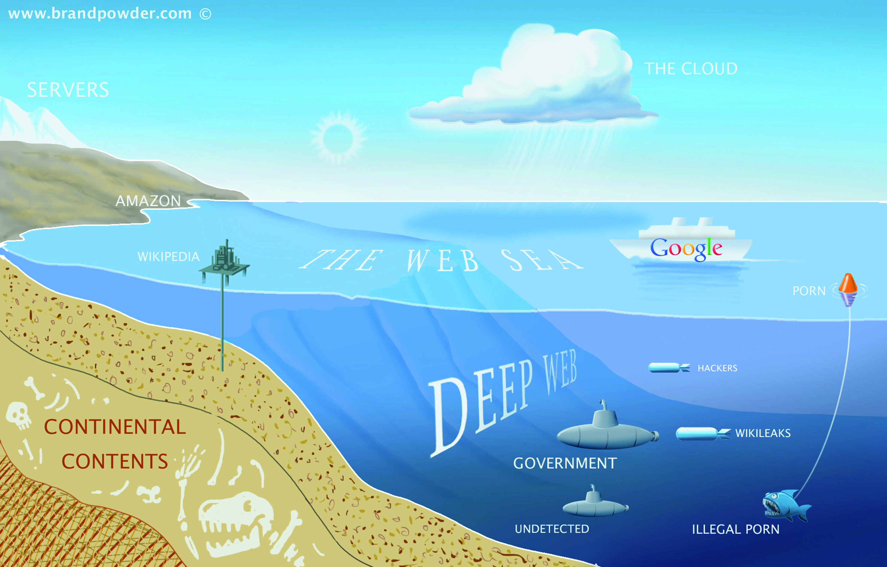
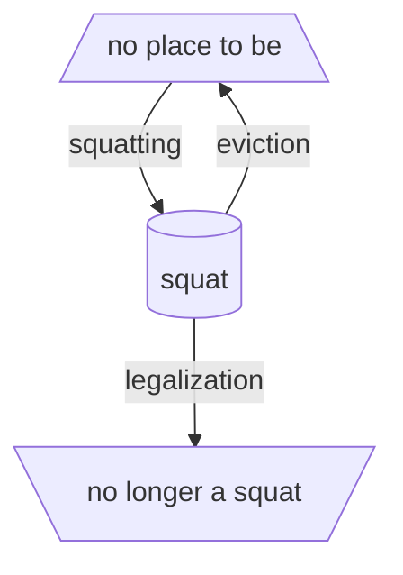
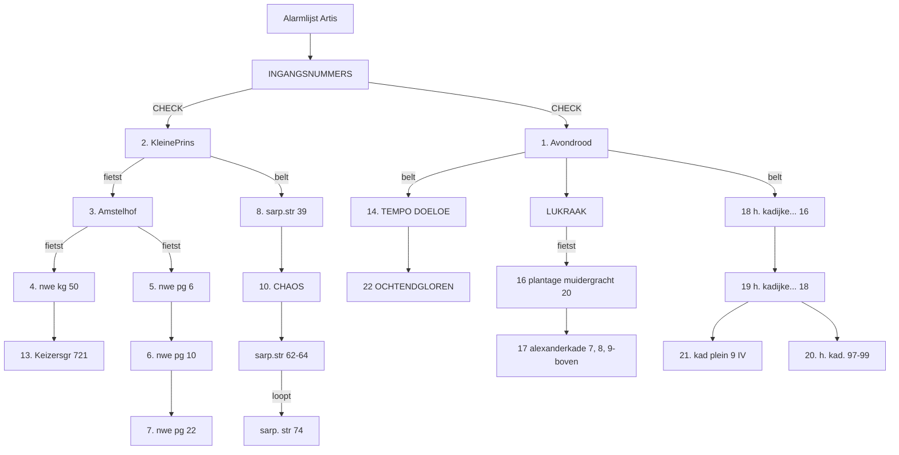
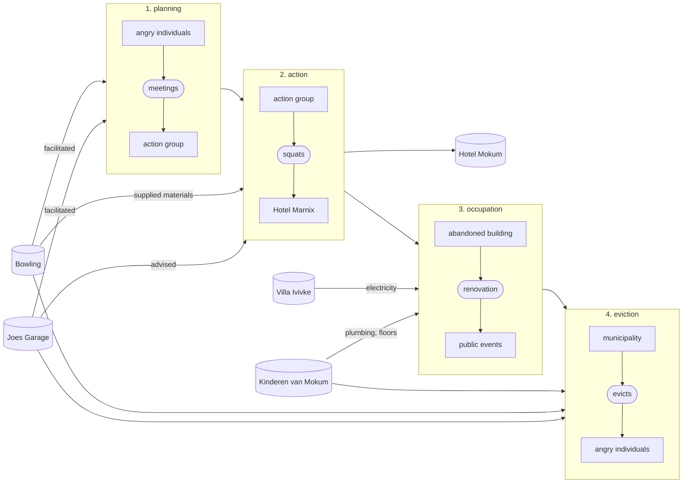
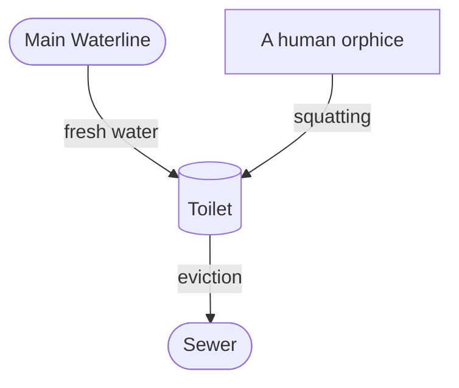

# New Dependencies

[TOC]

## Abstract

*Dear Reader,*

*This text is a nomadic journey from the (or: this) abstract to the material. I am trying to establish a lineage between a spatial practice like squatting and a (for lack of a better term) digital practice like (for lack of a better term) self-hosting. There are several similarities in the urgencies both of these practices (can) address, but while squatting is battle-tested and well established, it seems that digitally, we often still struggle to find useful tactics to counteract the effects of the cloud. Even though the analogy is limited (we can not simply apply the spatial logic of the physical to the virtual) this essay is an attempt to find ways in which our experience with the negotiation of physical space can help us with our digital conundrum.*

*First, I examine the spatial and geographical metaphors we (have) use(d) to describe the internet, and argue that any understanding of it as a separate, autonomous space is insufficient. I then argue that tactics and sentiments from the squatting movement could be applied to the digital. As an example, I examine the functioning of squats not as autonomous spaces per se, but rather as nodes situated in larger contexts and (support) networks, reliant on a new set of dependencies that they define for themselves. I conclude with examples, specific to the city of Amsterdam, in which the two domains merge. I assume a certain understanding of what is wrong with the internet today. You can find a summary of this, a starting point of sorts, in the appendix.*

fig. A.1: A Thundercloud, a mix of a cloud icon and the international squatting sign that resembles a lightning strike.

## 0 Starting Point

| self hosting                                               | squatting                                                  |
| ---------------------------------------------------------- | ---------------------------------------------------------- |
| refusing (privacy) policies ✅                              | refusing (housing) policies ✅                              |
| hosting and serving (files) ✅                              | hosting and serving (people) ✅                             |
| programming (computers) ✅                                  | programming (events) ✅                                     |
| don't pay rent (software as service) ✅                     | don't pay rent (actual rent) ✅                             |
| community building (licenses and policies) ✅               | community building (door policies) ✅                       |
| security (encryption) ✅                                    | security (barricades) ✅                                    |
| constant maintenance ✅                                     | constant maintenance ✅                                     |
| resist cloud control ✅                                     | resist crowd control ✅                                     |
| using existing infrastructures ✅                           | using existing infrastructures ✅                           |
| recycling (old hardware) ✅                                 | recycling (building materials)  ✅                          |
| open source principles ✅                                   | open source principles ✅                                   |
| following manuals and protocols ✅                          | following manuals and protocols ✅                          |
| improvised structures & unconventional design strategies ✅ | improvised structures & unconventional design strategies ✅ |
| disaster always imminent: data loss ✅                      | disaster always imminent: eviction ✅                       |
| Everything went downhill from ~2010 ✅                      | Everything went downhill from ~2010 ✅                      |
| nostalgia ✅                                                | nostalgia ✅                                                |
| nomadic in nature: changing ip addresses ✅                 | nomadic in nature: changing addresses ✅                    |
| situating yourself in a network ✅                          | situating yourself in a network ✅                          |
| de-appropriating someone else's space ❌                    | de-appropriating someone else's space ✅                    |

fig. 0.1: A lot of words in tech are referring to things in the real world.

## 1 Cloud Gazing

On September 12, 2010, the YouTube Channel revelation13net uploaded a video titled *By Psychokinesis a Psychic turns a Cloud into a Square Cloud in Sept. 2010*.[^1] In this video, a man films the sky with a handheld camera for 2 minutes and 18 seconds. The viewer sees a single cloud on an otherwise entirely blue sky, lined by some trees on the edge of the frame. We never see the person holding the camera but can hear them speak throughout the video. They introduce themselves as *T. Chase* and explain that they will now attempt to change the shape of the cloud into a square through psychic powers. They keep repeating this statement like a mantra of sorts, altering and distorting their voice as the video progresses. The cloud slowly changes shape, and by the end of the video it does look more like a square than in the beginning of the video, though it's hard to say whether this might just have been the way it was always going to naturally change shape.

In September 2008, the free software advocate Richard Stallman expressed his concerns regarding cloud computing to *The Guardian*, claiming that it was stupid[^2] and just a way to lock users into proprietary ecosystems. Stallman is a prominent advocate for privacy and the open source movement, and (among a lot of other things) the founder of the *Free Software Foundatio*n. He is well-respected in the tech community, but his statements about cloud computing received mixed responses. He was accused of populism[^3] for supposedly ignoring the lived realities of actual users who are often already trapped in their operating systems and office suites, and don't necessarily have the capacities to practice the cloud refusal he was preaching. Others accused Stallman of simply stating the obvious. Reuven Cohan[^4] illustrated this criticism with a still from an episode of the animated TV show *The Simpsons*, which later ended up becoming something of a meme. The image shows a newspaper clipping in which Abe Simpson, the elderly father of one of the protagonists, Homer Simpson, angrily shakes his fist at the sky under the headline *Old Man Yells at Cloud*. Since my 30th birthday last year, I have sometimes thought this image is actually about me.

The Cloud is a mythical space. Its name alludes to its opaque-ness, veiling what it actually describes, which you could call network infrastructure, or maybe just someone else's computer.[^5] Interestingly, the concept originates from exactly this position of not knowing, of occlusion. In network diagrams the cloud is traditionally used to denote parts of the network that we have no control over or no concrete knowledge about. It's the part beyond the blinking lights of our router, it’s *internet*. Its shape alludes to the uncertainty of what is out there, something elusive that constantly changes shape, is hard to grasp. The cloud is something we don't understand, by definition.

This inherent uncertainty is maybe why attempts to refuse it can often feel futile. Even defining what it exactly is that we are refusing is already a tiring exercise. As is often the case with computers, the conversation is one-sided, with us yelling at the cloud, trying to shape it, but not getting a response, because the cloud doesn't care. Despite this perceived futility, a vague feeling of urgency remains.

In 2019, web designer Becca Abbe sensed the dawn of what she called *The Internet's Back-to-the-Land Movement*,[^6] a new movement of users away from the cloud, in reference to the 1960s counter cultural movements away from the cities in the US.[^7] It seems tempting to leave the celestial cloud behind, with all its fake news and inequalities, to get back down to the *ground truth,* so to say. But what exactly is this *land* we would return to, and who exactly is it that is going there?

[^1]: “By Psychokinesis a Psychic Turns a Cloud into a Square Cloud in Sept.  2010,” n.d. youtube.com, Accessed January 14, 2022, [https://www.youtube.com/watch?v=KNYo69XiDfA](https://www.youtube.com/watch?v=KNYo69XiDfA).
[^2]: Bobbie Johnson, “Cloud Computing Is a Trap, Warns GNU Founder,” The Guardian, September 29, 2008, sec. Technology, https://www.theguardian.com/technology/2008/sep/29/cloud.computing.richard.stallman.
[^3]: Mathew Ingram, “Hey Hey, You You — Get off of My Cloud,” web.archive.org, September 29, 2008, https://web.archive.org/web/20081122005447/http://www.mathewingram.com/work/2008/09/29/hey-hey-you-you-get-off-of-my-cloud/.
[^4]: Reuven Cohen, “Stupid Redux : Old Man GNU Yells at Cloud,” web.archive.org, September 29, 2008, <https://web.archive.org/web/20081205032726/http://www.elasticvapor.com/2008/09/stupid-redux-old-man-gnu-yells-at-cloud.html>.
[^5]: This sentiment has become a meme of sorts, printed on mugs, stickers and t-shirts that you can buy all over the internet, including, not surprisingly, on Amazon. “Tech Humor There Is No Cloud ..Just Someone Else’s Computer,” amazon.com, n.d., <https://www.amazon.com/Humor-There-cloud-someone-computer/dp/B07KW5MPH2>.
[^6]: Becca Abbe, “The Internet’s Back-To-The-Land Movement,” are.na, February 7, 2019, <https://www.are.na/blog/the-internet%27s-back-to-the-land-movement>.
[^7]: Which, in turn, directly informed the early beginnings of Silicon Valley's tech world.

## 2 Surfing the Web

fig. 2.1: None of this makes any sense. Thank you Paul Bille for finding this image.

Before the cloud was a cloud it was an ocean. We know this, because it could be *surfed*. In 1986, when the internet wasn't commercially available yet, it was mostly being used by scientists and governments. That year, in the Netherlands, Hans Rosenberg from Utrecht University founded the non-profit organization *SURF*,[^8] which ran *SURFnet*, a computer network linking different academic institutions.[^9] A few years later, in 1989, and in direct proximity to the ocean, Susan Estrada of the San Diego Supercomputer Center founded one of the first internet service providers (ISP) in the world, and, since *SURFnet* was taken, settled on the name *CERFnet*.[^10]

In 1991, CERFnet released a promotional comic book, *The Adventures of Captain Internet And CERF Boy*. Filled to the brim with rad crossword puzzles and bad puns, it recounts the story of Diana Domain, her surfboard-slinging alter ego Captain Internet and her side kick CERFboy, fighting against their nemesis Count Crackula.[^11] Unaware of all of this, just a year later, librarian Jean "netmom" Armour Polly published an article called *Surfing the Internet*[^12] on the University of Minnesota Wilson Library Bulletin, and shortly after that, Tom Mandel of Stanford Research Institute (SRI) wrote another one called *Surfing the Wild Internet*.[^13]

What all these examples have in common is that they evoke the fun of the web, but also the skill required to, well, surf it, as well as some sense of the fluidity, randomness, chaos, and even danger that it presented.[^14] Using the internet was a sport, something you did for fun, and temporarily, before hanging up your wet suit and returning to real life.[^15] Especially back then, when cities[^16] and interfaces were less smooth, people were less sad[^17] and personal computers were just beginning to become a thing, it perfectly captured this new, mysterious and seemingly bottomless place that was the internet[^18] (other exhausted geographic metaphors include cyberspace, the electronic frontier and the information superhighway).

Today nobody *surfs* anymore (the ocean has evaporated into the cloud, you could say). But despite the immiscibility of water and technology, the image of the internet as a separate space free from the constraints of the *aground*, physical world, a vast ocean that just has to be navigated by a skilled steersman[^19] with an appropriate vessel,[^20] lingers as residue if you know where to look: in the ports and berths that we use to connect our computers to the internet, in *anchor* links, torrent sites,[^21] browser icons[^22] or the names of NFT marketplaces.[^23] The Network is eternal,[^24] and so is the ocean.

fig. 2.2: Those times are over, the internet is neither an ocean or a superhighway anymore. 1994 Advertising by Honda in an [outdoor magazine](https://books.google.nl/books?id=dc5rdg49tpUC&pg=PA83&lpg=PA83&dq=honda+%22spend+your+whole+life+on+the+information+superhighway%22&ots=8XaK4b9KBv&sig=ACfU3U1K-xQfXarY8aAC2thkeGYZ-MyFug&hl=en#v=onepage&q&f=false)

[^8]: Samenwerkende Universitaire Reken Faciliteiten, *Co-operative University Computing Facilities*
[^9]: *SURFnet* still exists today, and, among other things, founded and operates *eduroam*, an authentication infrastructure letting users in higher education facilities use wifi, which many readers might be familiar with.
[^10]: Originally, Estrada had wanted to reference San Diego's reputation as a surfers' paradise. CERFnet was an abbreviation for *California Education and Research Federation Network*, and a reference to Vint Cerf, one of the inventors of the TCP/IP protocol and so-called fathers of the internet. Today, Cerf works for Google as Chief Internet Evangelist.
[^11]: CERFnet, *The Adventures of Captain Internet and CERF Boy*, 1st ed. (San Francisco: CERFnet, 1991), <https://archive.org/details/CaptainInternetAndCERFBoyNumber1October1991/mode/2up>.
[^12]: Jean Armour Polly, “Version 2.0.2 \_Revised,” *Netmom.com* (blog), December 15, 1992, <https://www.netmom.com/images/pdf/Surfing_the_Internet_2_02.pdf>.
[^13]: Tom Mandel, “Surfing the Wild Internet.” SRI International Business Intelligence Program, 1993, <https://preterhuman.net/docs/SURFING_THE_WILD_INTERNET>.
[^14]: Interestingly, one of the best articles on the history of the term was published in the completely-not-tech-related surfer magazine *Surfer Today*, in which they quote Armour Polly on her intentions. SurferToday.com, “The Women Who Coined the Expression ‘Surfing the  Internet,’” SurferToday.com, Accessed January 14, 2022, <https://www.surfertoday.com/surfing/the-woman-who-coined-the-expression-surfing-the-internet/amp>.
[^15]: “The idea of cyberspace posed a line of separation between the internet and the real world. Cyberspace would be a separate universe. Created by people, enabled by technology, and occupied by information. Geopolitically, it would be like the sea once was. An unregulated and fluid space where ordinary rules need not apply." Metahaven, *Black Transparency : The Right to Know in the Age of Mass Surveillance* (Berlin: Sternberg Press, 2015), XV.
[^16]: René Boer, “Smooth City Is the New Urban,” Archis, May 29, 2018, <https://archis.org/volume/smooth-city-is-the-new-urban/>.
[^17]: Anastasia Kubrak, “User-Agent: If Everything Is so Smooth, Why Am I so Sad?” Master Thesis, 2018.
[^18]: Arguably it helped that the term was so visual, which gave way to an endless sea of illustrations of people literally surfing on their peripherals. The Hairpin, “People Literally Surfing the Web,” The Hairpin, February 17, 2011, <https://www.thehairpin.com/2011/02/people-literally-surfing-the-web/>.
[^19]: The word *cybernetics* originally developed from the word steersman. Harpers, Douglas. “Cybernetics (N.),” In *Online Etymology Dictionary*, Douglas Harper, 2022.
[^20]: See: Netscape Navigator
[^21]: See: Pirate Bay
[^22]: See: Safari
[^23]: See: Opensea.io
[^24]: transmediale e.V., “The Eternal Network,” archive.transmediale.de, 2020, <https://archive.transmediale.de/content/the-eternal-network-1>.

## 3 Back to the Sea

> *If you want to build a ship, don’t drum up people to collect wood and don’t assign them tasks and work, but rather teach them to long for the endless immensity of the sea.*

—Antoine de Saint-Exupery, probably[^25]

The appeal of the vast ocean never fully disappeared, and while some are trying their best to get back to the land, others just want to get back to the sea. Whereas *homesteading* describes self-sufficient life on land, *seasteading* takes this idea several steps further and out into the open sea (hypothetically, at least). Seasteading is an idea from San Francisco, and advocated for by the Seasteading Institute, which in turn was funded by venture capitalist and strangely obsessive *Lord of the Rings* fan Peter Thiel,[^26] with the goal of making governments *smart*. Claiming that most of the land in the world is already taken, the seasteaders propose building floating cities in international waters, free from convention, regulation, and taxes.

Up until 2020 most attempts to make these dreams come true had been of moderate success, with crypto millionaire, anti-taxer[^27] and anti-vaxxer[^28] Chad Elwartowski coming closest when he and his girlfriend spent two months living in a small, elevated, floating platform 12 nautical miles off the coast of Thailand.[^29] Elwartowski is one of the founders of *Ocean Builders*, a company dedicated to the promotion of seasteading, which has been developing so called *SeaPods*, floating luxury homes that look remarkably similar to Apple AirPods in renders.[^30] The platform in Thailand (which looked nothing like those renders) had been the first prototype.

But in 2020 Ocean Builders decided to give it one more try. Due to the COVID-19 pandemic, the cruise ship industry had almost gone under and they managed to buy an old, 245m cruise ship for a bit less that $10m, around ⅒ of its pre-pandemic price. They named it the MS Satoshi, after the presumed author of the original Bitcoin white paper. The plan was to lay anchor off the coast of Panama, where it would be incorporated into an artificial, floating island in the shape of the Bitcoin B.[^31] Until then they would auction off the 777 cabins[^32] to a clientele of digital nomads, startup founders and crypto enthusiasts, and finally establish the first truly free, crypto-only (and mostly male), seasteading society (or *seavilization*)[^33].

Maybe it's stretch to claim there is a (mostly metaphorical) affinity of everything-crypto to the ocean and the freedoms it promises. But many have described the feeling of web3[^34] to be reminiscent of the early days of the internet, among them Signal founder and former sailboat-squatter[^35] Moxie Marlinspike.[^36] And the image just *fits*—it speaks of a desire for the internet (the world?) to be a wide, open and adventurous place again.

In any case, the ocean builders didn't fare well on their endeavors. Journalist Sophie Elmhirst recounts the following unfolding of unfortunate events in great schadenfreude-laden detail for *The Guardian*.[^37] What was supposed to have become a crypto-pirate-radio of the 21st century ended in financial disaster before the ship ever reached Panama.[^38] According to scholar Flavia Dzodan, libertarian leaps for freedom like this fail because they don't bother to answer the question of who will do all the cleaning.[^39] In her article, Elmhirst sums up the MS Satoshi's ultimate dilemma. *"The high seas"*, she writes, *"while appearing borderless and free, are, in fact, some of the most tightly regulated places on Earth”*.

fig. 3.1: Not as endless and free as we thought. Still from the 1998 movie *The Truman Show*.

[^25]: De Saint-Exuper, author of *The Little Prince*, never really said this. Instead, this quote is paraphrased from his 1948 book *Citadelle*. However, this adaptation is much more widely known, and fits the context of this chapter better than the original.
[^26]: At the time of writing, Thiel has founded a total of six companies that are named after places and objects in J. R. R. Tolkien's *Lord of the Rings*. BBC News, “Who Is Peter Thiel and Why Is He Advising Donald Trump?” *BBC News*, December 14, 2016, sec. Technology, https://www.bbc.com/news/technology-38315682.
[^27]: Elwartowski openly shares many of his views on reddit. Elwar, “Government Theft,” reddit.com, June 22, 2021, <https://www.reddit.com/r/AskReddit/comments/o5jepd/what_do_you_wish_was_illegal/h2pagzw/>.
[^28]: Elwar, “MRNA Spike Protein….” reddit.com, June 30, 2021, <https://www.reddit.com/r/AskReddit/comments/oanhr8/what_invention_has_done_more_harm_than_good/h3kfxdh/>.
[^29]: When the Thai government discovered the existence of their seastead, Elwartowski and his girlfriend had to flee the country in fear of prosecution for violating the country's independence. Elwartowski logged the details of their dramatic escape on his vlog. seasteading, “THE FIRST SEASTEADERS 6: Fleeing the Death Threat,” youtube.com, February 29, 2020, <https://youtu.be/OovkeOuZsqU?t=340>.
[^30]: Current renders can be found on the project's website. “Ocean Builders – Life above the Waves!” oceanbuilders.com. Accessed January 15, 2022. <https://oceanbuilders.com/>.
[^31]: The scale of the project becomes clear in a whitepaper the team published: Rüdiger Koch, “Convert Cruise Ships into Sustainable Seasteads—New Life for the Cruise Ship Industry to Create New Life on the Sea,” Ocean Builders, December 22, 2020, <https://2oxut21weba5oivlniw6igeb-wpengine.netdna-ssl.com/wp-content/uploads/2020/12/2020-12-22-Convert-Cruise-Ships-Into-Sustainable-Seasteads.pdf>.
[^32]: Elwar, “So, I Am Buying a Cruise Ship and Naming It MS Satoshi…AMA,” reddit.com, October 20, 2020, <https://www.reddit.com/r/Bitcoin/comments/jefmth/so_i_am_buying_a_cruise_ship_and_naming_it_ms/>.
[^33]: A term I regretfully cannot take credit for.
[^34]: “Web1: Read—Web2: Read, write—Web3: Read, write, own.” Peter Yang, “Odyssey DAO - What Is Web3?” www.odysseydao.com, 2021, <https://www.odysseydao.com/articles/what-is-web3>.
[^35]: Marlinspike founded the Anarchist Yacht Club, which involved the squatting of derelict boats in order to fix them up and sail the world. In 2004 Marlinspike and 3 friends sailed to the Bahamas on the *Pestilance*, documenting their journey in a short film. Moxie Marlinspike, “Hold Fast,” www.vimeo.com, 2011, <https://vimeo.com/15351476>.
[^36]: In a 2022 article, Marlinspike outlines his experience with web3. While expressing excitement from his position as a developer, he claims that web3 doesn't actually deliver on many of its promises of decentralization, a nautical example of which is the monopoly of the platform opensea.io. Moxie Marlinspike, “My First Impressions of Web3,” Moxie Marlinspike, January 7, 2022, <https://moxie.org/2022/01/07/web3-first-impressions.html>.
[^37]: Elmhirst outlines how, the day the ocean builders officially gained ownership of the ship, its certificates of seaworthiness had expired. They had to sail it from Greece to Gibraltar to have it dry-docked and inspected, before finally starting the voyage across the Atlantic to Panama. There they had hoped to be able to de-register the ship, for it to legally become a floating residency in order escape strict maritime law, but the government of Panama insisted that, while they were allowed to anchor, the MS Satoshi had to officially remain a ship. This led to a lot of issues regarding the disposal of waste water and especially insurance: the team was unable to find anybody that would agree to insure their stationary crypto-ship, and facing the enormous costs of running it, including having a crew on board at all times, and the fact that they were not able to sell enough cabins, they had to cancel their plans and sell the ship, before ever making it to Panama. Sophie Elmhirst, “The Disastrous Voyage of Satoshi, the World’s First Cryptocurrency Cruise Ship,” *The Guardian*, September 7, 2021, <https://www.theguardian.com/news/2021/sep/07/disastrous-voyage-satoshi-cryptocurrency-cruise-ship-seassteading>.
[^38]: In a resigned last blogpost, Elwartowski blamed the corona pandemic conspiracy by the global elites. Chad Elwartowski, “MS Satoshi’s Journey Coming to an End – Viva Vivas,” vivavivas.com, December 19, 2020, <https://vivavivas.com/2020/12/19/ms-satoshis-journey-coming-to-an-end/>.
[^39]: Taken from a personal conversation.

## 4 Back to the Land

While today most people would agree that the internet is tightly regulated, in its beginning a lot of people thought of it borderless and free. *A Declaration of the Independence of Cyberspace*,[^40] which John Perry Barlow, founding member of the Electronic Frontier Foundation, published in 1996, is often used as an example of this false optimism. As their name suggests, in the 90s, the EFF perceived the internet as a new frontier, a wild and unexplored space for settlers to claim, where they could build new lives, new utopias, new modes of (smart?) governance. Barlow's text reads as a challenge to the governments of what he calls the Industrial World, or the world outside of the computers, who, according to him, had no legitimate claim to govern cyberspace.

Twenty-five years later this document has been critiqued to exhaustion. Many[^41],[^42],[^43],[^44] people have pointed out, and Barlow himself has admitted since, that this clear division between digital and physical space is not a very good model for describing the world—after all, the internet runs on real computers, which stand in real rooms that are connected to the rest of the world with real cables, all of which is powered by real electricity.[^45] The internet obviously runs on physical infrastructure,[^46] which exists in the physical world.

In his essay *Imagining the Internet: Explaining our Digital Transition*, Brewster Kahle, founder of the Internet Archive, explores the different metaphors that we have collectively used throughout the years to try and understand the internet.[^47] According to him, around 2010 the internet became more and more mobile, and more and more tied to our real identities. Around that time, cartoons depicting the internet shifted in tone: the surfers of the 90s became prisoners, bound to their oversized phones with heavy chains. With anonymity, the optimism of the 90s had evaporated.

Today the virtual is not separate but augmented,[^48] which is maybe why the image of the cloud, hovering above us, overlaid like another layer in Photoshop (or Gimp (or blimp?)), continues to stick around (that and the relentless power of marketing). As the gap between the cloud and the real world collapses, we have to think differently about the issues and inequalities inherent to both, since we can no longer treat them as independent from one another. Consequently, inequalities in the virtual (where we are limited to the possibilities the interface affords us)[^49] cannot be solved from within it, just as code running in a sandbox cannot affect the system outside of it.

If Cyberspace was the indefinite space between the nodes, that magical place that existed between your computer and mine, then a digital back-to-the-land movement has to focus precisely on these nodes and their physical connections, the underlying infrastructure, which is overwhelmingly *grounded*, even if sometimes submerged in water. We don't need spatial metaphors, because we are dealing with real, physical space.[^50] Luckily for us, we have much more experience in negotiating physical space than virtual space.

fig 4.1: A group of people negotiating physical space. The occupation of Hotel Mokum, photo by Sammy Iason, 2021.

[^40]: John Perry Barlow, “A Declaration of the Independence of Cyberspace,” Electronic Frontier Foundation, February 8, 1996, <https://www.eff.org/cyberspace-independence>.
[^41]: Andrew Blum, *Tubes : A Journey to the Center of the Internet,* New York: Ecco, 2012.
[^42]: Mark Graham, “Geography/Internet: Ethereal Alternate Dimensions of Cyberspace or Grounded Augmented Realities?” *The Geographical Journal* 179, no. 2 (2013): 177–82. <http://www.jstor.org/stable/43868547>.
[^43]: Lisa Parks, “Mediating Animal-Infrastructure Relations.” Being Material, 2019.
[^44]: Evan Roth, *Landscapes*, 2016.
[^45]: Nicola Jones, “How to Stop Data Centres from Gobbling up the World’s Electricity,” *Nature* 561, no. 7722 (September 2018): 163–66. <https://doi.org/10.1038/d41586-018-06610-y>.
[^46]: Tom Parfitt, “Georgian Woman Cuts off Web Access to Whole of Armenia,” The Guardian, April 6, 2011, <https://www.theguardian.com/world/2011/apr/06/georgian-woman-cuts-web-access>.
[^47]: Brewster Kahle, “Imagining the Internet: Explaining Our Digital Transition,” are.na, July 26, 2018, <https://www.are.na/blog/reimagining-the-internet>.
[^48]: The artist and design theorist Silvio Lorusso argues something similar in his text *The User Condition: Computer Agency and Behavior*, where he quotes art critic and essayist Joanne McNeil: "As smartphones blurred organizational boundaries of online and offline worlds, spatial metaphors lost favor. How could we talk about the internet as a place when we’re checking it on the go, with mobile hardware offering turn-by-turn directions from a car cup holder or stuffed in a jacket pocket?". Silvio Lorusso, “The User Condition,” theusercondition.computer, February 12, 2021, <https://theusercondition.computer/>.
[^49]: We can not, for example, just log into our social media account, and delete some of the data they have collected from us (or in many cases even delete our account)—they didn't make the buttons for that.
[^50]: To an extent, of course. The immateriality of data (not infrastructure) affords the virtual the capacity for redundancy. To use the famous *piracy* example, I can copy a movie and the original file remains untouched, which is, as of the time of writing, still not possible with a car.

## 5 Occupying the Land

fig. 5.1 In the words of singer Nelly Furtado, All good things come to an end. Thank you to Ada Reinthal for the initial diagram. Written in mermaid.js.

Squatting is the act of occupying an unoccupied space without owning it or having permission to use it. It occurs around the world and is mostly connected to poverty and homelessness, where people without alternatives build settlements on unoccupied land, which over time often develop into shanty towns and slums. In 2003, the United Nations estimated that globally more than 1 billion people were living in squats and slums, projecting this number to increase up to 1.5 billion by 2020.[^51] For most of these people, squatting is a tactic to survive.

In the Global North the term usually means something different. Here, squatting is mostly residential, meaning that it involves the occupation of vacant buildings in the city. While it's a response to the various inequalities in housing here, and as a tactic still presents the only alternative to homelessness for many (for example: undocumented) people, it also often has an activist dimension. In their eponymous 2019 book,[^52] the collective *Architectures of Appropriation* conceptualizes squatting in the Netherlands specifically not only as a social movement and historical phenomenon but as a kind of *spatial activism*. 

In the Netherlands, squatting developed into a politically motivated movement after World War 2, but it wasn't until 1971 that squatters acquired legal protection,[^53] and became institutionalized. By 1980 there were weekly squatting information hours (*Kraakspreekuren*) in every Dutch city, where squatters would give free advice to whomever was interested, and the action itself was protocolized in the form of freely available manuals, including the interaction with the authorities and police. In the book, Architectures of Appropriation suggest that since its beginnings, the squatting movement has had a decidedly *open source* character.

In 2010, around the time the internet became a cloud, squatting became a criminal offense in the Netherlands.[^54] In the following two years more than 330 squats were evicted in Amsterdam alone.[^55] In its prime, this network of squatted places had amounted to an independent, parallel society of sorts.[^56] This aspect of embedding yourself in a *network* is a central aspect of political squatting—whether it's the internal network of the occupants, a local network with the neighbors, a regional network with the local scene, or an international network of political squatters around the world.

One way this *networked-ness* might be epitomized is in the convention of naming a newly-squatted building after the address where it is located.[^57] By doing this, the squatters embed themselves into the broader (social) context of the city, as well as into the (local area) network of other squats there, while being simultaneously site specific and location independent: if they get evicted, the collective can squat another place next week, and the place will have a different address and a different name. Its identity will simultaneously be the same and completely different, similar to the way a computer gets assigned a new IP address in a network.

The connections between these nodes in a network are not abstract but can and have been diagrammatically mapped out, as on an emergency list of the former Amsterdam squat Plantage Dok.[^58] This network diagram does not include a cloud, an unknown factor beyond its control. If a cloud, the unknown, were to be included in this schematic, it would present *the threat* it was created to protect its members from in the first place. Instead of a network that is concerned with things like scalability, it operates on different principles. It is in its essence a network of solidarity.

fig. 5.2 No cloud in sight on the *Alarmlijst Arti*s (here expressed in a mermaid.js script)

[^51]: United Nations Human Settlements Programme, The Challenge of Slums: Global Report on Human Settlements, 2003, London; Sterling, Va: Earthscan Publications, 2003.
[^52]: René Boer, Marina Otero Verzier, Katía Truijen, and Johannes Schwartz, *Architecture of Appropriation : On Squatting as Spatial Practice* (Rotterdam: Het Nieuwe Instituut, 2019), 11.
[^53]: That year a court ruled that if squatters could prove that they had established so-called *house peace (huisvrede)* they would enjoy the same legal protection in their homes as everyone else, meaning they could not just be evicted by the police without the ruling of a judge. This continues the legal grounds for squatting actions in the Netherlands even today.
[^54]: Despite the raging housing crisis, which has only worsened since then. Between 2010 and 2020, the (already high) average rent price per square meter in Amsterdam increased by around 50%. Statista Research Department, “Amsterdam, the Hague, Rotterdam, Utrecht: Average Rent 2010-2019 | Statista,” Statista, Statista, May 12, 2021, <https://www.statista.com/statistics/612227/average-rent-in-four-largest-cities-in-the-netherlands-by-city/>.
[^55]: Het Reformatorisch Dagblad, “Amsterdam Ontruimt 330 Panden Sinds  Kraakwet,” RD.nl, June 15, 2012, <https://www.rd.nl/artikel/450870-amsterdam-ontruimt-330-panden-sinds-kraakwet>.
[^56]: Architectures of Appropriation list alternative housing projects, (sub)cultural venues, food distribution centers, peoples' kitchens, legal support, media outlets and medical services as nodes in this network. René Boer et al., *Architecture of Appropriation*, 18.
[^57]: Examples in Amsterdam include OT301 (located at Overtoom 301) and W139 (Warmoesstraat 139).
[^58]: In a time before cell phones, this flowchart, composed on a typewriter and distributed through copying machines, mapped out how, in case of an emergency such as an attack by violent groups like the police or thugs sent by the owner, the different nodes in the immediate network should be contacted for support, in which order, by who, and by what means (by *fiets*, meaning by bike, or by *bellen*, meaning by phone). Boer et al., 55.

## 6 Welcome to Hotel Mokum

fig 6.1: A former meme

Many of us struggled with the pressure, the excitement, the exhaustion, the uncertainty, the lack of structure, impostor syndrome. The let-down effect was real, immediately after the action a number of people got sick. Most of us had stopped exercising, ate unhealthily, and couldn't keep up with simple household tasks. Someone said their home had started to look like a squat while our squat had slowly started to look like a home. At the same time, most of us experienced difficulty in leaving, in going home, and felt guilty when we missed just a day or two.

We squatted Hotel Mokum on October 16, 2021. None of us had really expected to succeed—in the secretive meetings with the *real* squatters in which we planned the action (out of a general distrust of technology we always had to leave our phones in another room), the best-case scenario was nothing more than a rhetorical bridge into infinitely more likely crisis scenarios of varying gravitas: *of course, at that moment the police can just decide to leave, but more likely they will [insert various degrees of state violence here]*. But then it all turned out differently, and they did leave, and there we were, 20-odd 20-somethings and me, and all six floors of the former hotel right in the center of Amsterdam were ours, and every news outlet in town wanted to talk to us.

The day of the action we got drunk, the day after we started programming. Our first event was a series of screenings, curated by Mateo and Jeffrey Babcock from *Jeffrey's Underground Cinema(s)*. From then on we kept going. In the first month, we organized a neighborhood lunch, political cafés, screenings, a screen printing workshop, a chess tournament, an exhibition with more than 70 participants, a demonstration and seemingly infinite amounts of bar nights. Fueled by a mix of enthusiasm, disbelief and constant fear of eviction, we went on and on, and every time it got better and bigger, and every time it was packed.

When we didn't have a public program, we worked on the building: It had been gutted to the core and in the two years that it had been abandoned, it had decayed dramatically. After changing the locks, we cleared out the carcasses of the pigeons that had been trapped inside, cleaned the floors of their excrements, built a toilet for ours, pumped out the water from the crawlspace beneath, built a bar, set up internet throughout the building (piggybacking on the wifi from the hotel across the street), built living rooms and bed rooms, furnished it all, and cleaned—everything, endless amounts of times. Hardly any of us had ever squatted before, let alone on this scale, and without the unconditional and selfless support and expertise from helpers, friends and members of the squatting scene, we could have never pulled any of it off.

Whatever time was left, we spent in meetings. We had to organize and decide on events, fill the sleeping schedule, plan the renovations, find legal representation, write public statements, apply for funding, talk to an endless stream of journalists, talk to the neighbors, invite activists and politicians, deny entry to other activists and politicians, form connections to other squats, talk to the owner and formulate a corona policy. We organized on the fly—we set up Signal groups and a Matrix server, learned hand signs, kept times, moderated meetings, argued and solved conflicts, did check-ins and kept notes of everything. We decided collectively—not simply by majority, but looking for consensus even in disagreement.

Even though most of us didn't live at Hotel Mokum, we needed this place, and it needed us. We were starting to neglect the lives we had outside of Hotel Mokum—it was consuming us. After a month, we came together in an *emo meeting* to discuss the emotional aspects of our involvements. It was important to create this space for us to listen to each other, let each other air grievances and send each other messages of support. Unanimously, we agreed that this month had been one of the most fulfilling months of our lives, but we had all known that before. That had been the collective experience. At the emo meeting we acknowledged what happened outside of it. For a brief moment, the collective dissipated into a collection of individuals, each with their own, unique experience, with complaints, insecurities and dirty apartments.

One by one we assured each other, complimented each other on *good shares*. It was emotional and supportive. A lot of us hadn't known each other before the action, but in this moment of allowing ourselves to be vulnerable in front of each other, it felt like we had been doing this for years. We had become nodes in a (support) network, and our network, in turn, was just a node in an even larger network. As someone put it, outside the doors was now a city, not just a collection of houses. Far from autonomous, we depended on each other's solidarity; we knew that we *could* depend on each other, and that these were voluntary new dependencies.

fig. 6.2: Angry individuals becoming angry individuals. The story of Hotel Mokum and its enablers, in mermaid.js

## 7: Trespassing, an afterword

fig. 7.1: It's not rocket science

There are few contact points where the augmented nature of the virtual becomes as explicit as in the mostly cloudy city of Amsterdam. By 1993, internet access here was still limited to a small number of households, but in 1994 Marleen Stikker, founder of the Waag Society, started the freenet[^59] *De Digitale Stad (The Digital City)*.[^60] For many Amsterdammers, this was the first opportunity to access the internet. Aptly named, the *Digital City* still used the *metaphor* of the city not only in its name but also as an interface. To send emails you would have to go to the post office, for public discussions you would visit the cafe. While text-based initially, many parts were later illustrated.

Today, in Europe's largest data center hub,[^61] the relationship between the cloud and the city (the *augmenter* and the *augmentee*, if you will) has fundamentally shifted. Their conflation is maybe most apparent in the example of Airbnb. Arguably, Amsterdam has suffered especially severely from Airbnb's business model.[^62] In his 2016 essay *Techno-Feudalism and The Tragedy of The Commons*, William Kherbek explains this process:[^63]

1. People rent out surplus rooms and apartments on Airbnb.
1. As there is usually more money to be made on Airbnb than with traditional rental agreements, more and more living space is offered on the platform, leading to a decrease in availability of traditional housing and a consequential increase in rent prices as supply shortens.
1. The extra income from Airbnb lets the hosts keep up with rising costs of living (for example: rent) as wages continue to stagnate, which creates a dependency.
1. This leads to pressure on people to participate in the secondary housing market (Airbnb) in order to keep up and survive.

Kherbek argues that, while this process is commonly called platform capitalism, the situation is actually closer to feudalism than to capitalism (even if capitalism is the outcome): Big tech companies (*lords*) generate wealth from their users (*serfs*), exploiting their labor and data. The users find themselves in a state of inverted totalitarianism,[^64] where the democratic structures supposed to keep things in check have been reduced to formalities. At the same time, refusal to take part in the system becomes increasingly penalized through social and financial pressure, as demonstrated in the Airbnb example. Under techno-feudalism the few own the property the many have to live on and the data enclosed in the walled garden of the cloud is the pasture from the tragedy of the commons.[^65]

In a similar vein, Silvio Lorusso argues that we can apply the logic of labor to the digital[^66] and that there are no class-less computers: there are coders[^67] and there are users[^68] (hackers and vectoralists in the words of McKenzie Wark).[^69] At the core of this argument is a discussion about (computer) literacy: how much do we, as users, need to understand about the inner workings of the machines we use in order to retain capacity for action? Lorusso quotes Paul Graham, who states that in an ideal world, ordinary users shouldn't [have to] know what drivers or patches are. Similarly, in his 2018 book *The New Dark Age* the artist and writer James Bridle claims we shouldn't need to know how to code in order to use a computer, after all we don't need to understand plumbing to use the toilet.[^70]

When we squatted Hotel Mokum, we didn't know anything[^71] about plumbing, which was a problem because the building didn't have a toilet (or running water), so we needed to build one. However, a lot of the more experienced squatters, it turns out, do know about plumbing, as for them it's a source of frequently occurring issues, and within a few days they had helped us build one. While this example certainly makes a case for the benefits of knowing about plumbing (it disconnects the issue from *professionalization*, because the point here is not that squatters would be more *professional* than the rest of us), it also carries a liberating sentiment. While these practical skills might be vital for activism, they are not a requirement. In the right environments, we can pick them up along the way. They (the labor) is liberated from class—you don’t need to be a plumber to plumb.

Lorusso writes that the problem might not be illiteracy, but that instead it's about the ability to define our own behavior patters. Constant imposed driver and system updates often disrupt these (the toilet metaphor has really been stretched to its limits here), and as such limit our capacity for action. Not updating can be a good thing, since it lets us stick to personal and potentially un- or no longer intended ways of doing things. This ad-hoc approach to the urgencies of the situation is something central to the squatting movement. In their book, Architectures of Appropriation pose that unscripted and collective spatial tactics used by squatters to transform the spaces they inhabit have left behind a spatial heritage that still speaks of the desire to put the right to *live* above the right to own (private) property.[^72]

If there is anything to learn from the world of squatting when building a digital practice, it is not about a literal translation of the concept of occupation from the physical to the virtual,[^73] but about this: the capacity for action resulting from these hack-y, DIY, non-scalable and non-streamlined behavior patterns and solutions, in reusing and adapting existing infrastructures and materials. These routines and tactics are a way of claiming the infamous agency over the environments we navigate, whether they be physical or digital, of breaking out of the sandbox, of refusing to take part in a game we can't win. Sticking to the metaphor of the city, the routines are the deciding factor in whether we can consider ourselves *residents* or *tourists*. In the city of the 21st century, tourists are omnipresent, to the universal dismay of the residents. In some cases they might even outnumber them. While they shape their environments[^74], even the most curious among them ultimately don’t have control over them—they are limited to the paths laid out for them by travel guides, influencers and the hotels and Airbnb’s of the world. Of course the lines are blurry here (are you a guest or a tourist when you visit someone?) and all of this is not to say that tourists have bad intentions or don’t care, but by definition they lack routines and administrator rights[^75]. Residents, however, know their environments, they shape them to their likings over long periods of time. They know and avoid the tourist traps. They have neighborhoods, and they have neighbors. Neighbors that can hopefully help them fix their toilets.

[^59]: Freenets were proto-www networks of computers that gave users free access to information and in some cases (like with DDS) access to the internet.
[^60]: Preceding \*Geocities\* by a few months, another network employing the metaphor of the city.
[^61]: Already back in 2019, the (potentially biased) Dutch Data Center Association called the Netherlands the leader in data centers in Europe. Dutch Data Center Association, “The Netherlands Is European Leader in Data Centers,” Dutch Data Center Association, June 11, 2019, <https://www.dutchdatacenters.nl/en/nieuws/dutchdatacenters2019-2/>.
[^62]: While this statement is maybe hard to quantify, the effects of Airbnb on the housing market are well documented. Vincent van der Bijl, “The Effect of Airbnb on House Prices in  Amsterdam,” Master Thesis, 2016, <https://files.vastgoedbibliotheek.nl/Server/getfile.aspx?file=docs/publicaties/site/UVA/Bijl_VM.pdf>.
[^63]: William Kherbek, “Techno-Feudalism and the Tragedy of the Commons,” *Doggerland*, no. 1 (2016).
[^64]: Sheldon S. Wolin, *Democracy Incorporated: Managed Democracy and the Specter of Inverted Totalitarianism*. Princeton; Oxford: Princeton University Press, 2017.
[^65]: The Tragedy of the Commons is an economics problem conceived by economist William Forster Lloyd in 1833, in which everyone has equal access to a resource. The idea is that, if everyone were to act according to what they consider to be their immediate best interests, it would lead to over consumption, and the depletion of the resource.
[^66]: Silvio Lorusso, “The User Condition,” theusercondition.computer, February 12, 2021, <https://theusercondition.computer/>.
[^67]: The only one more powerful than the coder might be *non-user*, the one who doesn't use computers to begin with. Lorusso evokes the images of big-tech-CEOs that don't let their kids use social media, alluding to the privilege required for this sort of refusal, which is also expressed in Kherbek's example of Airbnb.
[^68]: One can't help but think of the quote attributed to Edward Tufte, that the only industries that call their customers *users* are software companies and drug dealers, which is another way to think of dependencies.
[^69]: Mckenzie Wark, A Hacker Manifesto, Cambridge, MA; London: Harvard University Press, 2004.
[^70]: Or, he adds, without our toilet trying to kill us. Bridle, James. *New Dark Age: Technology and the End of the Future*. Orca Book Services, 2019.
[^71]: shit
[^72]: Boer et al., 10
[^73]: For example *domain squatting*, the practice of buying up domain names of companies and well known individuals before they do, mostly with the goal of selling them for a higher price afterwards.
[^74]: After our inevitable eviction, for example, Hotel Mokum is, at the time of writing, being turned back into a hotel and travel agency. 
[^75]: Lorusso points out that in UNIX based operating systems, users have /home folders, which is not true for iOS and Android users, rendering them effectively homeless. Lorusso, “The User Condition”.

## Appendix: Incomplete and Unordered List of Reasons to Refuse *The Cloud*

- Workers in the Global South are being exploited and our devices are assembled by modern day slaves.[^76]
- Rare metals like cobalt, essential for lithium batteries, are extracted under horrible conditions and, among others, by children.[^77],[^78]
- Other metals, like lithium, are extracted from indigenous lands without consent or regard for the environment.[^79]
- E-Waste is polluting the planet and is being dumped in landfills without regulations in the global south, poisoning both the lands and the people.[^80]
- Tech companies are constantly spying on us through our devices. The right to privacy is being eroded.[^81]
- This information is passed on to government agencies and the surveillance state is being facilitated.[^82]
- Social media companies profit from radicalization, and a divided political landscape, fake news, disconnected filter bubbles and rabbit holes are not by-products but part of the product.[^83]
- The internet, and most devices we carry in our pockets, like smart phones, are developed from US military technology.[^84]
- Tech is a race to the brain stem. Some of the most educated people in the world put all their energy into selling us ads. Thinking we could resist the machinery is like thinking we could win against a super computer in chess.[^85]
- It's addictive on purpose. At places like the Stanford Persuasive Technology Lab people have been trained to specifically find ways of persuading users to change their behavior through digital stimuli like rewards.[^86]
- Big companies that have incomprehensible terms and conditions instead of constitutions can censor users without any form of accountability or oversight.[^87]

fig. AP.1: The terms cloud is a bit of a stand-in for everything wrong with the internet, in this case

[^76]: Jacob Kastrenakes, “Apple Suppliers Linked to Uyghur Forced Labor in New Report,” The Verge, May 10, 2021, <https://www.theverge.com/2021/5/10/22428899/apple-suppliers-china-uyghur-forced-labor-report>.
[^77]: Per Axbom, “The Slavery Supported by That Device in Your Pocket,” ethical.net, July 6, 2020, <https://ethical.net/technology/the-slavery-supported-the-device-in-your-pocket/>.
[^78]: Amnesty International, “This Is What We Die For,” 2016, <https://www.amnesty.org/en/wp-content/uploads/2021/05/AFR6231832016ENGLISH.pdf>.
[^79]: James Greenblatt, “Lithium Mining & Indigenous Populations,” Psychiatry Redefined, December 14, 2020, <https://www.psychiatryredefined.org/lithium-mining-indigenous-populations/>.
[^80]: Elizabeth Gribkoff, “Consumers Will Throw Away 63.3 Million Tons of Electronic Waste This Year. Where Will It Go?” Children’s Health Defense, October 18, 2021, <https://childrenshealthdefense.org/defender/electronic-waste-digital-dumps-global-south/>.
[^81]: Douglas J. Leith, “Obile Handset Privacy: Measuring the Data IOS and Android Send to Apple and Google,” In *Security and Privacy in Communication Networks. SecureComm 2021. Lecture Notes of the Institute for Computer Sciences, Social Informatics and  Telecommunications Engineering, Vol 399*, edited by Joaquin Garcia-Alfaro, Shujun Li, Radha Poovendran, Hervé Debar, and Moti Yung, S.L.: Springer, 2021.
[^82]: Ewen MacAskill, Gabriel Dance, Feilding Cage, Greg Chen, and Nadja Popovich, “NSA Files Decoded: Edward Snowden’s Surveillance Revelations Explained,” The Guardian, The Guardian, March 23, 2014, <https://www.theguardian.com/world/interactive/2013/nov/01/snowden-nsa-files-surveillance-revelations-decoded>.
[^83]: Kari Paul and Dani Anguiano, “Facebook Crisis Grows as New Whistleblower and Leaked Documents Emerge,” The Guardian, October 23, 2021, <https://www.theguardian.com/technology/2021/oct/22/facebook-whistleblower-hate-speech-illegal-report>.
[^84]: James Clark, “How the US Military Invented the iPhone,” Task & Purpose, September 8, 2016, <https://taskandpurpose.com/gear-tech/us-military-invented-iphone/>.
[^85]: Center For Humane Technology, “Technology Is Downgrading Humanity: Let’s Reverse That Trend Now,” Medium, August 3, 2019, <https://medium.com/@HumaneTech_/technology-is-downgrading-humanity-lets-reverse-that-trend-now-893fb9f6e580>.
[^86]: Stanford University, “Persuasion through Mobile Devices and Operant Conditioning via Interactive Technology,” mediaX at Stanford University, Accessed January 14, 2022, <https://mediax.stanford.edu/research-projects/scs-fogg/>.
[^87]: ToS;DR Team, “Terms of Service; Didn’t Read,” Tosdr.org, Terms of Service; Didn’t Read, 2019, <https://tosdr.org/>.
